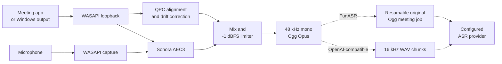

<p align="center">
  
</p>

<h1 align="center">Nota</h1>

<p align="center">
  <strong>Record meetings locally. Transcribe them on your terms.</strong>
</p>

<p align="center">
  A local-first Windows recorder for meeting apps and browser calls.<br>
  No bots, no telemetry, no virtual audio device—and optional bring-your-own ASR.
</p>

<p align="center">
  English · <a href="README.zh-CN.md">简体中文</a>
</p>

<p align="center">
  
  
  
  
  
  <a href="../../actions/workflows/ci.yml"></a>
</p>

<p align="center">
  <a href="#get-nota"><strong>Get Nota</strong></a>
  ·
  <a href="#quick-start">Quick start</a>
  ·
  <a href="#build-from-source">Build from source</a>
</p>

<p align="center">
  
</p>

## Why Nota?

Meeting audio is scattered across native clients, browser tabs, microphones, and output devices. Built-in recording is inconsistent, screen recording creates unnecessarily large video files, and many meeting assistants require a bot or upload private conversations to the cloud.

Nota gives Windows one focused recording workflow:

- capture a selected meeting application's process tree;
- fall back to a selected system output when application capture is not suitable;
- combine remote audio and microphone into one compact file;
- keep capture, processing, recovery, and storage on your computer.

## Highlights

| | |
|---|---|
| **Focused application capture** | Record Zoom, Teams, Feishu/Lark, Tencent Meeting, Chrome, Edge, or another selected application without silently widening the scope. |
| **Universal system mode** | Capture everything playing through a selected Windows output device when you need broader coverage. |
| **Microphone + remote audio** | Align independent device clocks, apply local echo cancellation, and deliver a single mixed recording. |
| **Crash-safe recording** | Write to a recovery file first, validate complete Ogg pages, and recover interrupted sessions after restart. |
| **Compact output** | Produce 48 kHz mono Ogg Opus at 64 kbps by default—typically around 30 MB per hour. |
| **Optional transcription** | Send a recording only when you click Transcribe or explicitly enable automatic transcription. Use a LAN FunASR server or another OpenAI-compatible provider. |
| **Local speaker identities** | Explicitly extract anonymous CAM++ voiceprints, confirm real names, and reuse them in later meetings. Names, matching, and biometric vectors stay in the local Rust backend. |
| **Offline recording** | Recording, playback, recovery, and file management remain fully usable without an account or network connection. |

## Works with the meetings you already use

| Application | Recommended mode | Notes |
|---|---|---|
| Zoom | Selected application | Captures the Zoom process tree |
| Microsoft Teams | Selected application | Captures the desktop client |
| Feishu / Lark | Selected application | Captures the desktop client |
| Tencent Meeting | Selected application | Captures the desktop client |
| Google Meet in Chrome or Edge | Selected application | Captures all audio from the selected browser process tree |
| Other audio applications | Selected application or system audio | System mode captures the selected output device |

> [!IMPORTANT]
> Browser capture is process-based, not tab-based. Selecting Chrome or Edge records all audio produced by that browser, not only the current meeting tab.

## How it works



Nota uses Windows Core Audio directly. Selected-application mode uses Windows process-loopback capture with the target process tree; system mode uses endpoint loopback for a selected output device. Microphone audio is captured independently, aligned with QPC timestamps, resampled to correct clock drift, processed locally, and mixed before Opus encoding.

There is no FFmpeg runtime or virtual sound card. Transcription is a separate, optional workflow. For FunASR, Nota resumably uploads the original Ogg recording as one durable meeting job so speaker labels are reconciled across the whole meeting. Other OpenAI-compatible providers retain the temporary 16 kHz mono WAV chunk workflow; temporary chunks are removed after upload.

## Get Nota

Nota is currently an early preview. Download the latest build from [GitHub Releases](../../releases/latest):

- a per-user NSIS installer that does not require administrator access;
- a portable ZIP that keeps settings and recovery data in LocalAppData.

> [!NOTE]
> The preview is unsigned. Windows SmartScreen may show an “Unknown publisher” warning. You can also [build Nota from source](#build-from-source).

## Quick start

1. Open Nota and choose **Selected application** or **All system audio**.
2. Select the meeting application or Windows output device.
3. Choose a microphone, or disable microphone recording.
4. Confirm the destination and start recording.
5. Stop and save from the window, tray menu, or keyboard shortcut.
6. Open **Recordings** to play the result, manage the file, or start an optional transcription.

### Optional speech-to-text

Open **Settings → Speech transcription**, add one or more providers, and choose a default:

- **FunASR** for a server on your own computer or LAN;
- **OpenAI-compatible** for any service implementing the compatible audio-transcription endpoint.

Use an API root ending in `/v1`, for example `http://192.168.1.20:8000/v1`, then enter the model ID or load it from `/v1/models`. FunASR requires Nota ASR Server batch protocol v1: the original Ogg is uploaded resumably, server processing can resume by audio window, and final speaker labels share one whole-meeting scope. When manually starting or restarting a FunASR transcript, you can keep automatic speaker detection or specify a known count from 1 to 64; automatic transcription always uses automatic detection. Other OpenAI-compatible providers continue to use resumable 10-minute WAV chunks with a 2-second overlap. The original 48 kHz Ogg Opus recording is never replaced.

Completed transcripts can be copied or exported as UTF-8 TXT. When the provider returns speaker labels, both outputs use one `speaker_N：transcribed text` line per segment, replacing `speaker_N` with a locally confirmed participant name when available; otherwise Nota preserves the provider's plain transcript.

Speaker identification is an independent, user-triggered action. Select a
compatible Nota ASR Server in **Voiceprints**, then use **Identify speakers**
from a completed recording. Nota sends only bounded voice samples for
anonymous CAM++ extraction, performs matching locally, and asks you to confirm
every name. Confirmed names are used consistently in the detail view, copy,
and TXT export while raw `speaker_N` labels remain unchanged in the transcript.

Default shortcuts:

| Shortcut | Action |
|---|---|
| `Ctrl+Alt+F9` | Start, pause, or resume |
| `Ctrl+Alt+F10` | Stop and save |

Shortcuts can be changed or disabled in Settings. Closing the main window keeps Nota available in the system tray.

## Privacy by design

**Your meeting audio never needs to leave your computer unless you choose a transcription provider.**

- No account or sign-in
- No telemetry or analytics
- No upload during recording
- No upload unless you manually start transcription or explicitly enable automatic transcription
- No automatic meeting detection
- No automatic recording
- No audio content in technical logs
- Fully functional offline when transcription is not used

Provider HTTP requests are made by the Rust backend; the interface has no general network permission. API keys are intentionally stored in plaintext in the local Nota SQLite database for a simple, maintainable open-source setup. Saved keys are masked in the interface, omitted from normal IPC reads, logs, errors, and exports, and provider configurations cannot be exported as a bundle. Anyone who can read your Windows account files may still be able to recover a saved key, so use a scoped key where your provider supports one.

Nota does not implement participant-notification or consent-acknowledgement workflows. Distributors and downstream developers may add policy-specific behavior when their deployment requires it.

## Reliability and recovery

Recording begins in `%LOCALAPPDATA%\Nota\Recovery` before the result is moved to the selected destination.

- Complete Ogg pages are flushed regularly.
- Normal stop writes an EOS marker before finalization.
- Interrupted files can be repaired to the last complete, validated Ogg page.
- Cross-volume saves use copy, verification, persistence, and only then recovery-file removal.
- Output and microphone streams recover independently after device interruptions.
- Low disk space triggers a warning below 200 MB and a safe stop below 50 MB.
- Paused time and system sleep are excluded from the final recording.

The default output directory is `Documents\Nota\Recordings`. Settings, the recording index, transcripts, participant names, voiceprints, and confirmed meeting mappings are stored locally in SQLite WAL mode; rotating technical logs are limited to 3 × 10 MB.

## Current limitations

- Windows 11 x64 only
- Simplified Chinese interface in the current preview
- Browser capture cannot be restricted to one tab
- One mixed output file; no separate microphone/system tracks
- No video, summaries, translation, transcript editing, or real-time streaming transcription
- Speaker identification requires provider-supplied diarization labels and a compatible Nota ASR Server; suggestions remain probabilistic until the user confirms them
- Transcription requires a user-configured FunASR or OpenAI-compatible service
- Echo-cancellation quality depends on the microphone, speakers, room, and device mode
- The preview is not code-signed

## Roadmap

- [ ] Publish reproducible GitHub releases
- [ ] Add Windows code signing
- [ ] Expand the tested device and meeting-client matrix
- [ ] Add an English interface and improve accessibility
- [ ] Add Windows on ARM64 support
- [ ] Add summaries and optional transcript editing

The roadmap intentionally stays focused on reliable local recording. Feature proposals are welcome in [Issues](../../issues).

## Build from source

### Prerequisites

- Windows 11 x64
- Rust stable
- Node.js 24 LTS (the exact development version is recorded in `.nvmrc`)
- npm 11.16.0 (pinned by `package.json`)
- Visual Studio 2022 Build Tools with **Desktop development with C++**
- Windows 11 SDK
- CMake

### Unified command entry point

Run Nota from the repository root through the npm scripts in `package.json`.
Complex Windows checks and release orchestration remain in `scripts/*.ps1`, but
they are exposed through npm so contributors do not need to memorize separate
PowerShell or Cargo entry points.

Install the locked dependencies after the first checkout:

```powershell
npm ci
```

| Command | Purpose | Primary output |
|---|---|---|
| `npm run dev` | Start the complete Tauri desktop development environment, including the Vite frontend and Rust backend | `src-tauri\target\debug\nota.exe` |
| `npm test` | Run all frontend tests once | Terminal test report |
| `npm run test:watch` | Watch files and rerun affected frontend tests | Interactive test process |
| `npm run check` | Check version consistency, build and test the frontend, then run Rust formatting, tests, and Clippy | No release package |
| `npm run build:exe` | Build the optimized desktop executable without installer bundling | `src-tauri\target\release\nota.exe` |
| `npm run build` | Build the optimized desktop executable and per-user NSIS installer | `src-tauri\target\release\nota.exe` and `src-tauri\target\release\bundle\nsis\` |
| `npm run release:windows` | Reinstall locked dependencies, run every check, generate licenses, NSIS, portable ZIP, and SHA-256 checksums | Root `release\` directory |

`npm run dev:web`, `npm run build:web`, and `npm run preview:web` are
frontend-only entry points used primarily by Tauri's `beforeDevCommand` and
`beforeBuildCommand` hooks or for isolated UI work. They do not provide the
Rust recording, SQLite, filesystem, or ASR backend. Use
`npm run tauri -- <command>` as the advanced pass-through to the Tauri CLI.

The ordinary and release-grade builds are intentionally separate.
`npm run build` performs only the work needed to create the desktop executable and NSIS
installer; it does not first run the full verification suite or create the
portable/checksum assets. `npm run release:windows` starts from locked
dependencies, runs all quality gates, invokes the same desktop build, and then
creates the distributable release assets.

Maintainers can follow the [release guide](docs/releasing.md) to synchronize the version, create a release tag, and let GitHub Actions prepare a reviewed draft Release.

## Project structure

```text
src/                               React and TypeScript interface
src-tauri/src/audio/wasapi.rs      Windows capture and device recovery
src-tauri/src/audio/dsp.rs         Alignment, resampling, AEC, mixing, limiting
src-tauri/src/audio/encoder.rs     Opus encoding and Ogg container
src-tauri/src/audio/recovery.rs    Validation, repair, and safe finalization
src-tauri/src/asr.rs               Provider clients, durable FunASR jobs, legacy chunking, and merge
src-tauri/src/voiceprints.rs       Bounded sample extraction, local matching, and confirmation sessions
src-tauri/src/storage.rs           SQLite settings, recording index, and transcripts
src-tauri/src/controller.rs        Recording state, IPC, tray, and file actions
```

The frontend receives typed state and confirmation metadata. Raw PCM, stored
API keys, and voiceprint vectors remain in Rust.

## Engineering documentation

Start with the [`docs` engineering index](docs/README.md) for the client
architecture, ASR integration state machine, data lifecycle, test and hardware
acceptance matrix, architectural decisions, and release process. The root
README remains the product and contributor entry point; detailed technical
semantics live beside the code under `docs/`.

## Contributing

Nota is preparing for a public open-source release. Contributions will be especially valuable in:

- Windows audio-device compatibility testing;
- meeting-client capture testing;
- Rust audio reliability and recovery;
- UI accessibility and localization;
- documentation and reproducible builds.

For now, please use [Issues](../../issues) for reproducible bug reports and focused feature proposals. A dedicated contribution guide will be added before the public launch.

## FAQ

<details>
<summary><strong>Does Nota join the meeting as a bot?</strong></summary>

No. Nota records Windows audio locally and never joins a call as a participant.
</details>

<details>
<summary><strong>Can Nota record Google Meet?</strong></summary>

Yes. Select Chrome or Edge as the capture target. Nota will capture the browser process tree, which means other audio from the same browser may also be included.
</details>

<details>
<summary><strong>Why Ogg Opus?</strong></summary>

Opus provides clear speech at a small file size. The default 64 kbps mono configuration is typically around 30 MB per hour and is supported by WebView2, VLC, and many modern players.
</details>

<details>
<summary><strong>What happens if Nota or Windows crashes?</strong></summary>

On the next launch, Nota scans recovery files, removes incomplete trailing data, writes a valid ending where possible, and lets the user recover or discard the session.
</details>

<details>
<summary><strong>When does Nota make a network connection?</strong></summary>

Recording never requires a network connection. Nota contacts only the ASR provider you configured, and only when you manually request transcription or enable automatic transcription. The badges and links in this README are served by GitHub and Shields.io, not by the Nota application.
</details>

<details>
<summary><strong>Where is my ASR API key stored?</strong></summary>

It is stored in plaintext in Nota's local SQLite database. Normal reads expose only whether a key exists, and Nota excludes it from logs and exports. This is a deliberate simplicity trade-off, not a secure credential vault.
</details>

## Acknowledgements

Nota is built with [Tauri](https://tauri.app/), [Rust](https://www.rust-lang.org/), [React](https://react.dev/), Windows Core Audio, [Sonora](https://github.com/dignifiedquire/sonora), and [Opus](https://opus-codec.org/). See [THIRD_PARTY_LICENSES.md](THIRD_PARTY_LICENSES.md) for dependency notices.

## License

An open-source license will be selected and added before the repository is made public. Until then, no license is granted for copying, modifying, or redistributing the source.

---

<p align="center">
  If Nota is the kind of private, dependable meeting recorder you want to see,<br>
  consider giving the project a ⭐ when it goes public.
</p>
