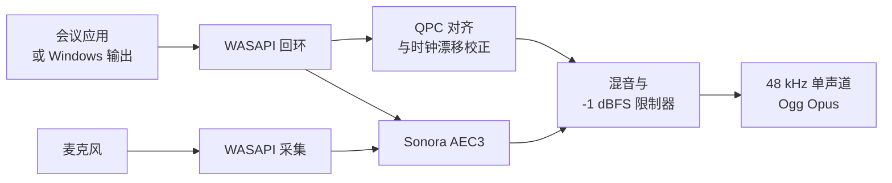

<p align="center">
  
</p>

<h1 align="center">Nota</h1>

<p align="center">
  <strong>记录每一场会议，把每一句话留在本地。</strong>
</p>

<p align="center">
  面向 Windows 会议客户端与浏览器会议的隐私优先录音工具。<br>
  无机器人参会、无云端上传、无虚拟声卡。
</p>

<p align="center">
  <a href="README.md">English</a> · 简体中文
</p>

<p align="center">
  
  
  
  
  
  <a href="../../actions/workflows/ci.yml"></a>
</p>

<p align="center">
  <a href="#获取-nota"><strong>获取 Nota</strong></a>
  ·
  <a href="#快速开始">快速开始</a>
  ·
  <a href="#从源码构建">从源码构建</a>
</p>

<p align="center">
  
</p>

## 为什么需要 Nota？

会议声音分散在桌面客户端、浏览器、麦克风和不同输出设备中。各平台自带的录音能力并不统一，系统录屏会产生体积庞大的视频文件，而不少会议助手需要机器人进入会议，或将私人谈话上传到云端。

Nota 为 Windows 提供一条专注的本地录音工作流：

- 捕获指定会议应用的进程树；
- 不适合指定应用时，可切换到所选系统输出设备；
- 将远端声音与麦克风合成为一个紧凑的音频文件；
- 采集、处理、恢复与存储全部在这台电脑上完成。

## 核心亮点

| | |
|---|---|
| **精准的应用录音** | 录制 Zoom、Teams、飞书、腾讯会议、Chrome、Edge 或其他指定应用，不会在失败时静默扩大录音范围。 |
| **通用的系统声音模式** | 需要覆盖更广时，捕获所选 Windows 输出设备播放的全部声音。 |
| **麦克风与远端声音合录** | 对齐独立设备时钟，在本地进行回声消除，最终交付一个混合录音。 |
| **崩溃安全** | 先写入恢复文件，校验完整 Ogg 页，并在应用重启后恢复中断的会话。 |
| **紧凑的输出文件** | 默认生成 48 kHz 单声道、64 kbps 的 Ogg Opus，通常约 30 MB/小时。 |
| **离线优先** | 无账号、无遥测、无云服务、无自动上传，运行时不建立外部网络连接。 |

## 支持你正在使用的会议工具

| 应用 | 推荐模式 | 说明 |
|---|---|---|
| Zoom | 指定应用 | 捕获 Zoom 进程树 |
| Microsoft Teams | 指定应用 | 捕获桌面客户端 |
| 飞书 / Lark | 指定应用 | 捕获桌面客户端 |
| 腾讯会议 | 指定应用 | 捕获桌面客户端 |
| Chrome 或 Edge 中的 Google Meet | 指定应用 | 捕获所选浏览器的全部进程树声音 |
| 其他发声应用 | 指定应用或系统声音 | 系统模式捕获所选输出设备 |

> [!IMPORTANT]
> 浏览器录音基于进程，而不是标签页。选择 Chrome 或 Edge 会录制该浏览器产生的全部声音，不仅是当前会议标签页。

## 工作原理



Nota 直接使用 Windows Core Audio。指定应用模式通过 Windows 进程回环捕获目标进程树；系统声音模式通过端点回环捕获所选输出设备。麦克风独立采集，通过 QPC 时间戳对齐、异步重采样校正设备时钟漂移，在本地处理并混音后编码为 Opus。

整个过程不需要 FFmpeg 运行时、虚拟声卡或云端处理服务。

## 获取 Nota

Nota 目前处于早期预览阶段，尚未公开发布二进制文件。

首个 GitHub Release 计划包含：

- 无需管理员权限、按当前用户安装的 NSIS 安装包；
- 无需安装的便携 ZIP，设置与恢复数据仍存放在 LocalAppData。

未来的公开版本会出现在 [GitHub Releases](../../releases)。在此之前，开发者可以[从源码构建](#从源码构建)。

> [!NOTE]
> 当前预览版尚未进行代码签名，Windows SmartScreen 可能显示“未知发布者”提示。

## 快速开始

1. 打开 Nota，选择 **指定应用** 或 **全部系统声音**。
2. 选择会议应用或 Windows 输出设备。
3. 选择麦克风，或关闭麦克风录制。
4. 确认保存位置并开始录音。
5. 从主窗口、托盘菜单或快捷键停止并保存。
6. 在 **最近录音** 中直接播放，或打开文件所在目录。

默认快捷键：

| 快捷键 | 操作 |
|---|---|
| `Ctrl+Alt+F9` | 开始、暂停或继续 |
| `Ctrl+Alt+F10` | 停止并保存 |

快捷键可以在设置中修改或关闭。关闭主窗口后，Nota 会继续驻留在系统托盘。

## 隐私优先

**你的会议音频无需离开这台电脑。**

- 无账号或登录
- 无遥测或分析
- 无云端上传或远程处理
- 不自动检测会议
- 不自动开始录音
- 技术日志不包含音频内容
- 运行时不建立外部网络连接

Nota 会在首次录音前显示一次参会者告知提醒。使用者仍应遵守所在地法律、会议规则和组织政策。

## 可靠性与恢复

录音会先写入 `%LOCALAPPDATA%\Nota\Recovery`，完成后再移动到用户选择的位置。

- 定期刷新完整 Ogg 页。
- 正常停止时先写入 EOS 标记，再完成封装。
- 中断文件可以恢复至最后一个校验通过的完整 Ogg 页。
- 跨磁盘保存采用复制、校验、持久化，最后才移除恢复文件。
- 输出声音与麦克风在设备中断后独立恢复。
- 磁盘空间低于 200 MB 时警告，低于 50 MB 时安全停止。
- 暂停和系统休眠时间不会写入最终录音。

默认输出目录为 `文档\Nota\Recordings`。设置与录音索引保存在本地 SQLite WAL 数据库中；滚动技术日志最多保留 3 × 10 MB。

## 当前限制

- 仅支持 Windows 11 x64
- 当前预览版界面仅提供简体中文
- 浏览器录音无法限制到单个标签页
- 只输出一个混合文件，不保留独立麦克风与系统音轨
- 仅录制音频，不包含视频、转写、摘要或说话人识别
- 回声消除效果会受到麦克风、扬声器、房间和设备模式影响
- 预览版尚未进行代码签名

## 路线图

- [ ] 发布可复现的 GitHub Releases
- [ ] 完成 Windows 代码签名
- [ ] 扩展设备与会议客户端验收矩阵
- [ ] 增加英文界面并改进无障碍体验
- [ ] 支持 Windows on ARM64

路线图会继续聚焦于可靠的本地录音。欢迎通过 [Issues](../../issues) 提交功能建议。

## 从源码构建

### 环境要求

- Windows 11 x64
- Rust stable
- Node.js 22
- Visual Studio 2022 Build Tools，包含 **Desktop development with C++**
- Windows 11 SDK
- CMake

### 开发运行

```powershell
npm ci
npm run tauri dev
```

### 测试

```powershell
npm test
cd src-tauri
cargo test --locked
```

### 发布构建

```powershell
.\scripts\build-windows.ps1
```

发布脚本会执行前端与 Rust 测试、生成第三方依赖许可证清单、构建 NSIS 安装包，并制作便携 ZIP。Cargo 与 npm 依赖版本均已锁定在仓库中。

维护者可以按照[发布指南](docs/releasing.md)同步版本、创建发布标签，并由 GitHub Actions 生成待审核的草稿 Release。

## 项目结构

```text
src/                               React 与 TypeScript 界面
src-tauri/src/audio/wasapi.rs      Windows 音频采集与设备恢复
src-tauri/src/audio/dsp.rs         对齐、重采样、AEC、混音与限制
src-tauri/src/audio/encoder.rs     Opus 编码与 Ogg 封装
src-tauri/src/audio/recovery.rs    校验、修复与安全完成录音
src-tauri/src/controller.rs        录音状态、IPC、托盘与文件操作
```

前端只接收状态、健康度、故障和电平事件，原始 PCM 始终保留在 Rust 音频管线中。

## 参与贡献

Nota 正在为公开开源做准备，以下方向尤其需要帮助：

- Windows 音频设备兼容性测试；
- 各会议客户端的录音测试；
- Rust 音频可靠性与崩溃恢复；
- 界面无障碍与本地化；
- 文档与可复现构建。

现阶段请通过 [Issues](../../issues) 提交可复现的问题和明确的功能建议。正式公开前会再补充独立的贡献指南。

## 常见问题

<details>
<summary><strong>Nota 会作为机器人进入会议吗？</strong></summary>

不会。Nota 只在本地捕获 Windows 音频，不会作为参会者加入会议。
</details>

<details>
<summary><strong>Nota 可以录制 Google Meet 吗？</strong></summary>

可以。请选择 Chrome 或 Edge 作为录音目标。Nota 会捕获浏览器进程树，因此同一浏览器中的其他声音也可能被录入。
</details>

<details>
<summary><strong>为什么选择 Ogg Opus？</strong></summary>

Opus 能以较小体积保存清晰语音。默认 64 kbps 单声道通常约为 30 MB/小时，并可由 WebView2、VLC 和许多现代播放器播放。
</details>

<details>
<summary><strong>如果 Nota 或 Windows 崩溃了怎么办？</strong></summary>

下次启动时，Nota 会扫描恢复文件、移除不完整的尾部数据、在可能时写入有效结尾，并让用户选择恢复或删除该会话。
</details>

<details>
<summary><strong>Nota 会通过互联网发送数据吗？</strong></summary>

不会。应用设计为无需外部网络连接即可运行。本 README 中的徽章与链接由 GitHub 和 Shields.io 提供，与 Nota 应用本身无关。
</details>

## 致谢

Nota 基于 [Tauri](https://tauri.app/)、[Rust](https://www.rust-lang.org/)、[React](https://react.dev/)、Windows Core Audio、[Sonora](https://github.com/dignifiedquire/sonora) 与 [Opus](https://opus-codec.org/) 构建。依赖声明参见 [THIRD_PARTY_LICENSES.md](THIRD_PARTY_LICENSES.md)。

## 许可证

仓库公开前会选择并加入开源许可证。在此之前，不授予复制、修改或重新分发源代码的许可。

---

<p align="center">
  如果你也期待一款私密、可靠的本地会议录音工具，<br>
  欢迎在项目公开后为 Nota 点亮一颗 ⭐。
</p>
