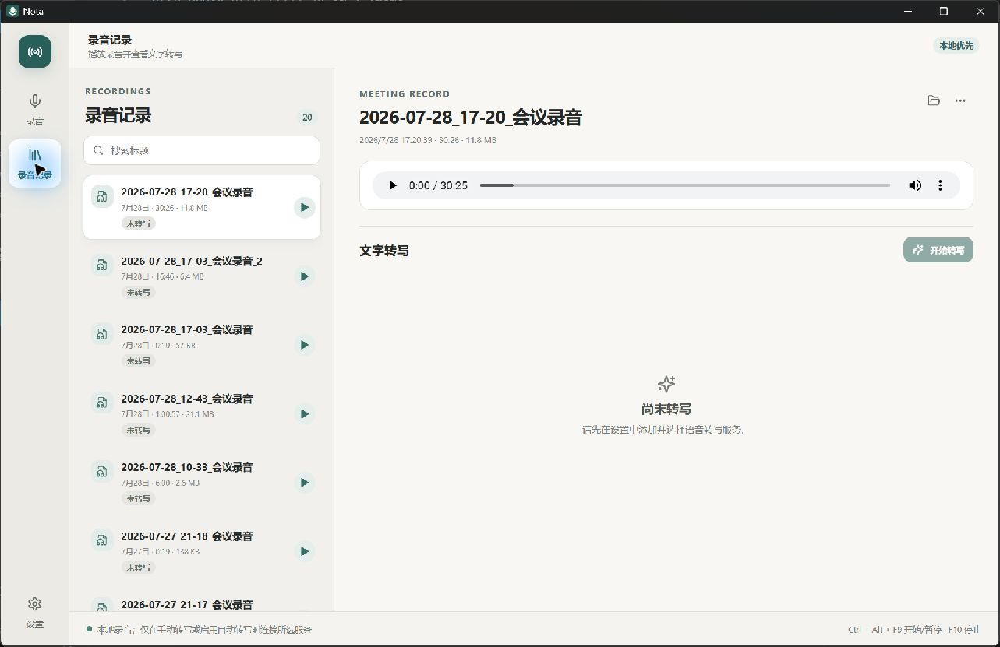
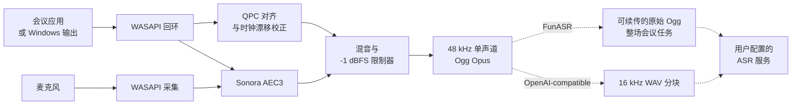

<p align="center">
  
</p>

<h1 align="center">Nota</h1>

<p align="center">
  <strong>把会议录在本地，按你的方式转成文字。</strong>
</p>

<p align="center">
  面向 Windows 会议客户端与浏览器会议的本地优先录音工具。<br>
  无机器人参会、无遥测、无虚拟声卡，并支持自选 ASR 服务。
</p>

<p align="center">
  <a href="README.md">English</a> · 简体中文
</p>

<p align="center">
  
  
  
  
  
  <a href="../../actions/workflows/ci.yml"></a>
</p>

<p align="center">
  <a href="#获取-nota"><strong>获取 Nota</strong></a>
  ·
  <a href="#快速开始">快速开始</a>
  ·
  <a href="#从源码构建">从源码构建</a>
</p>

<p align="center">
  
</p>

## 为什么需要 Nota？

会议声音分散在桌面客户端、浏览器、麦克风和不同输出设备中。各平台自带的录音能力并不统一，系统录屏会产生体积庞大的视频文件，而不少会议助手需要机器人进入会议，或将私人谈话上传到云端。

Nota 为 Windows 提供一条专注的本地录音工作流：

- 捕获指定会议应用的进程树；
- 不适合指定应用时，可切换到所选系统输出设备；
- 将远端声音与麦克风合成为一个紧凑的音频文件；
- 采集、处理、恢复与存储全部在这台电脑上完成。

## 核心亮点

| | |
|---|---|
| **精准的应用录音** | 录制 Zoom、Teams、飞书、腾讯会议、Chrome、Edge 或其他指定应用，不会在失败时静默扩大录音范围。 |
| **通用的系统声音模式** | 需要覆盖更广时，捕获所选 Windows 输出设备播放的全部声音。 |
| **麦克风与远端声音合录** | 对齐独立设备时钟，在本地进行回声消除，最终交付一个混合录音。 |
| **录音中切换麦克风** | 录音开始后仍可更换或关闭麦克风，不停止录音、不拆分记录，也不替换当前 Ogg 文件。 |
| **崩溃安全** | 先写入恢复文件，校验完整 Ogg 页，并在应用重启后恢复中断的会话。 |
| **紧凑的输出文件** | 默认生成 48 kHz 单声道、64 kbps 的 Ogg Opus，通常约 30 MB/小时。 |
| **可选语音转写** | 仅在手动点击转写或明确开启自动转写后发送录音；可使用局域网 FunASR 或其他 OpenAI-compatible 服务。 |
| **本地说话人身份** | 手动提取匿名 CAM++ 声纹、确认真实姓名，并在后续会议中复用；姓名、匹配过程和生物特征向量留在本机 Rust 后端。 |
| **离线录音** | 无需账号和网络即可完成录音、播放、恢复与文件管理。 |

## 支持你正在使用的会议工具

| 应用 | 推荐模式 | 说明 |
|---|---|---|
| Zoom | 指定应用 | 捕获 Zoom 进程树 |
| Microsoft Teams | 指定应用 | 捕获桌面客户端 |
| 飞书 / Lark | 指定应用 | 捕获桌面客户端 |
| 腾讯会议 | 指定应用 | 捕获桌面客户端 |
| Chrome 或 Edge 中的 Google Meet | 指定应用 | 捕获所选浏览器的全部进程树声音 |
| 其他发声应用 | 指定应用或系统声音 | 系统模式捕获所选输出设备 |

> [!IMPORTANT]
> 浏览器录音基于进程，而不是标签页。选择 Chrome 或 Edge 会录制该浏览器产生的全部声音，不仅是当前会议标签页。

## 工作原理



Nota 直接使用 Windows Core Audio。指定应用模式通过 Windows 进程回环捕获目标进程树；系统声音模式通过端点回环捕获所选输出设备。麦克风独立采集，通过 QPC 时间戳对齐、异步重采样校正设备时钟漂移，在本地处理并混音后编码为 Opus。

整个录音过程不需要 FFmpeg 运行时或虚拟声卡。转写是独立的可选流程。使用 FunASR 时，Nota 会把原始 Ogg 作为一个可续传、可恢复的整场会议任务上传，让说话人标签在整场会议内统一；其他 OpenAI-compatible Provider 继续使用临时 16 kHz 单声道 WAV 分块，分块上传后立即删除。

## 获取 Nota

Nota 目前处于早期预览阶段。可以从 [GitHub Releases](../../releases/latest) 下载最新版本：

- 无需管理员权限、按当前用户安装的 NSIS 安装包；
- 无需安装的便携 ZIP，设置与恢复数据仍存放在 LocalAppData。

> [!NOTE]
> 当前预览版尚未进行代码签名，Windows SmartScreen 可能显示“未知发布者”提示。你也可以[从源码构建](#从源码构建)。

## 快速开始

1. 打开 Nota，选择 **指定应用** 或 **全部系统声音**。
2. 选择会议应用或 Windows 输出设备。
3. 选择麦克风，或关闭麦克风录制。
4. 确认保存位置并开始录音。
   录音进行中可从实时面板更换或关闭麦克风，会议声音的采集范围不会改变。
5. 从主窗口、托盘菜单或快捷键停止并保存。
6. 打开 **录音记录** 播放、管理录音，或按需开始文字转写。

### 可选语音转写

打开 **设置 → 语音转写**，添加一个或多个 Provider 并选择默认项：

- **FunASR**：适合运行在本机或局域网中的服务；
- **OpenAI-compatible**：适合实现了兼容音频转写接口的其他服务商。

API 根地址统一以 `/v1` 结尾，例如 `http://192.168.1.20:8000/v1`。模型 ID 可以手工填写，也可以从 `/v1/models` 获取。FunASR 要求服务端支持 Nota 批处理协议 v1：原始 Ogg 可断点续传，服务端按音频窗口恢复处理，最终说话人标签采用整场会议作用域。手动开始或重新转写 FunASR 任务时，可以保留默认的“自动判断人数”，也可以指定 1–64 位已知说话人；自动转写始终使用自动判断。其他 OpenAI-compatible Provider 继续使用可恢复的 10 分钟 WAV 分块，相邻分块重叠 2 秒；原始 48 kHz Ogg Opus 录音始终保留。

完成后的转写可以复制或导出为 UTF-8 TXT。Provider 返回说话人标签时，两种输出都会按每个分段一行的 `speaker_N：转写文字` 格式生成；已有本地确认姓名时会用真实姓名替换显示，原始标签仍保留；没有说话人标签时则保留 Provider 的纯文本全文。

说话人识别是独立、由用户主动触发的功能。先在 **声纹管理** 中选择兼容的
Nota ASR Server，再到已完成转写的录音详情点击 **说话人识别**。Nota 只发送
有界语音样本，请服务端提取匿名 CAM++ 向量；姓名库、相似度匹配和确认记录都
保存在客户端本机。用户确认后，详情、复制全文和 TXT 导出会统一显示真实姓名，
而原始转写里的 `speaker_N` 不会被改写。

默认快捷键：

| 快捷键 | 操作 |
|---|---|
| `Ctrl+Alt+F9` | 开始、暂停或继续 |
| `Ctrl+Alt+F10` | 停止并保存 |

快捷键可以在设置中修改或关闭。关闭主窗口后，Nota 会继续驻留在系统托盘。

## 隐私优先

**除非你主动选择转写服务，否则会议音频无需离开这台电脑。**

- 无账号或登录
- 无遥测或分析
- 录音过程中不上传
- 仅在手动转写或明确开启自动转写后上传
- 不自动检测会议
- 不自动开始录音
- 技术日志不包含音频内容
- 不使用转写时可完全离线工作

所有 Provider HTTP 请求都由 Rust 后端发起，界面没有任意联网权限。为了保持开源实现简单、易用、易维护，API Key 会以明文保存在本机 Nota SQLite 数据库中。已保存密钥在界面中始终掩码，普通 IPC 读取只返回是否存在密钥，日志、错误与导出内容不会包含密钥，也不提供 Provider 配置整体导出。能够读取你 Windows 账户文件的人仍可能取得密钥，因此服务商支持时建议使用权限受限的 Key。

Nota 不内置参会者告知或同意确认流程。发行者和二次开发者可以根据具体部署要求自行增加相应功能。

## 可靠性与恢复

录音会先写入 `%LOCALAPPDATA%\Nota\Recovery`，完成后再移动到用户选择的位置。

- 定期刷新完整 Ogg 页。
- 正常停止时先写入 EOS 标记，再完成封装。
- 中断文件可以恢复至最后一个校验通过的完整 Ogg 页。
- 跨磁盘保存采用复制、校验、持久化，最后才移除恢复文件。
- 输出声音与麦克风在设备中断后独立恢复。
- 磁盘空间低于 200 MB 时警告，低于 50 MB 时安全停止。
- 暂停和系统休眠时间不会写入最终录音。

默认输出目录为 `文档\Nota\Recordings`。设置、录音索引、转写、参会人姓名、声纹和会议确认映射保存在本地 SQLite WAL 数据库中；滚动技术日志最多保留 3 × 10 MB。

## 当前限制

- 仅支持 Windows 11 x64
- 当前预览版界面仅提供简体中文
- 浏览器录音无法限制到单个标签页
- 只输出一个混合文件，不保留独立麦克风与系统音轨
- 不包含视频、摘要、翻译、转写文本编辑或实时流式转写
- 说话人识别依赖 Provider 返回的匿名分离标签和兼容的 Nota ASR Server；系统建议是概率结果，必须由用户确认
- 转写需要用户自行配置 FunASR 或 OpenAI-compatible 服务
- 回声消除效果会受到麦克风、扬声器、房间和设备模式影响
- 预览版尚未进行代码签名

## 路线图

- [ ] 发布可复现的 GitHub Releases
- [ ] 完成 Windows 代码签名
- [ ] 扩展设备与会议客户端验收矩阵
- [ ] 增加英文界面并改进无障碍体验
- [ ] 支持 Windows on ARM64
- [ ] 增加摘要与可选的转写文本编辑

路线图会继续聚焦于可靠的本地录音。欢迎通过 [Issues](../../issues) 提交功能建议。

## 从源码构建

### 环境要求

- Windows 11 x64
- Rust stable
- Node.js 24 LTS（准确的开发版本记录在 `.nvmrc`）
- npm 11.16.0（由 `package.json` 固定）
- Visual Studio 2022 Build Tools，包含 **Desktop development with C++**
- Windows 11 SDK
- CMake

### 统一命令入口

开发者从仓库根目录通过 `package.json` 中的 npm scripts 运行 Nota。复杂的
Windows 检查和发布编排保留在 `scripts/*.ps1`，但同样通过 npm 暴露，因而
无需记忆单独的 PowerShell 或 Cargo 命令。

首次检出代码后安装锁定依赖：

```powershell
npm ci
```

| 命令 | 用途 | 主要输出 |
|---|---|---|
| `npm run dev` | 启动完整的 Tauri 桌面开发环境，包括 Vite 前端与 Rust 后端 | `src-tauri\target\debug\nota.exe` |
| `npm test` | 单次运行全部前端测试 | 终端测试报告 |
| `npm run test:watch` | 监听文件变化并重复运行相关前端测试 | 交互式测试进程 |
| `npm run check` | 执行版本一致性、前端构建与测试、Rust 格式、测试和 Clippy 检查 | 不生成发布包 |
| `npm run build:exe` | 构建优化后的桌面程序，但跳过安装包封装 | `src-tauri\target\release\nota.exe` |
| `npm run build` | 构建优化后的桌面程序和按当前用户安装的 NSIS 安装包 | `src-tauri\target\release\nota.exe` 与 `src-tauri\target\release\bundle\nsis\` |
| `npm run release:windows` | 从锁文件重新安装依赖，执行完整检查，生成许可证报告、NSIS、便携 ZIP 和 SHA-256 | 根目录 `release\` |

`npm run dev:web`、`npm run build:web` 和 `npm run preview:web` 是纯前端入口，
主要供 Tauri 的 `beforeDevCommand`/`beforeBuildCommand` 钩子和界面调试使用；
它们不提供录音、SQLite、文件系统或 ASR Rust 后端。`npm run tauri -- <命令>`
保留为高级 Tauri CLI 透传入口。

普通开发构建与发布级构建有意分开：`npm run build` 只完成生成桌面程序和
NSIS 所需的构建步骤，不先运行完整测试，也不制作便携包和校验文件；
`npm run release:windows` 面向发布验收，会从干净依赖开始执行全部质量门禁，
然后调用同一个桌面构建并生成可分发资产。

维护者可以按照[发布指南](docs/releasing.md)同步版本、创建发布标签，并由 GitHub Actions 生成待审核的草稿 Release。

## 项目结构

```text
src/                               React 与 TypeScript 界面
src-tauri/src/audio/wasapi.rs      Windows 音频采集与设备恢复
src-tauri/src/audio/dsp.rs         对齐、重采样、AEC、混音与限制
src-tauri/src/audio/encoder.rs     Opus 编码与 Ogg 封装
src-tauri/src/audio/recovery.rs    校验、修复与安全完成录音
src-tauri/src/asr.rs               Provider 客户端、FunASR 持久任务、兼容分块与结果合并
src-tauri/src/voiceprints.rs       有界语音采样、本地声纹匹配与确认会话
src-tauri/src/storage.rs           SQLite 设置、录音索引与转写数据
src-tauri/src/controller.rs        录音状态、IPC、托盘与文件操作
```

前端只接收类型化状态与确认元数据；原始 PCM、已保存 API Key 和声纹向量始终留在 Rust 后端。

## 工程文档

客户端架构、ASR 集成状态机、数据生命周期、测试与硬件验收矩阵、架构决策和发布流程统一收录在 [`docs` 工程文档索引](docs/README.md)中。根 README 继续作为产品与贡献入口，详细技术语义则与代码一起维护在 `docs/` 下。

## 参与贡献

Nota 正在为公开开源做准备，以下方向尤其需要帮助：

- Windows 音频设备兼容性测试；
- 各会议客户端的录音测试；
- Rust 音频可靠性与崩溃恢复；
- 界面无障碍与本地化；
- 文档与可复现构建。

现阶段请通过 [Issues](../../issues) 提交可复现的问题和明确的功能建议。正式公开前会再补充独立的贡献指南。

## 常见问题

<details>
<summary><strong>Nota 会作为机器人进入会议吗？</strong></summary>

不会。Nota 只在本地捕获 Windows 音频，不会作为参会者加入会议。
</details>

<details>
<summary><strong>Nota 可以录制 Google Meet 吗？</strong></summary>

可以。请选择 Chrome 或 Edge 作为录音目标。Nota 会捕获浏览器进程树，因此同一浏览器中的其他声音也可能被录入。
</details>

<details>
<summary><strong>为什么选择 Ogg Opus？</strong></summary>

Opus 能以较小体积保存清晰语音。默认 64 kbps 单声道通常约为 30 MB/小时，并可由 WebView2、VLC 和许多现代播放器播放。
</details>

<details>
<summary><strong>如果 Nota 或 Windows 崩溃了怎么办？</strong></summary>

下次启动时，Nota 会扫描恢复文件、移除不完整的尾部数据、在可能时写入有效结尾，并让用户选择恢复或删除该会话。
</details>

<details>
<summary><strong>Nota 什么时候会联网？</strong></summary>

录音不需要网络。只有在你手动开始转写，或明确开启自动转写后，Nota 才会连接你配置的 ASR 服务。本 README 中的徽章与链接由 GitHub 和 Shields.io 提供，与 Nota 应用本身无关。
</details>

<details>
<summary><strong>ASR API Key 保存在哪里？</strong></summary>

它以明文保存在 Nota 的本地 SQLite 数据库中。普通读取只会返回“是否存在密钥”，日志和导出内容不会包含密钥。这是为了简单易维护而做出的明确取舍，并不等同于安全凭据保险库。
</details>

## 致谢

Nota 基于 [Tauri](https://tauri.app/)、[Rust](https://www.rust-lang.org/)、[React](https://react.dev/)、Windows Core Audio、[Sonora](https://github.com/dignifiedquire/sonora) 与 [Opus](https://opus-codec.org/) 构建。依赖声明参见 [THIRD_PARTY_LICENSES.md](THIRD_PARTY_LICENSES.md)。

## 许可证

仓库公开前会选择并加入开源许可证。在此之前，不授予复制、修改或重新分发源代码的许可。

---

<p align="center">
  如果你也期待一款私密、可靠的本地会议录音工具，<br>
  欢迎在项目公开后为 Nota 点亮一颗 ⭐。
</p>
