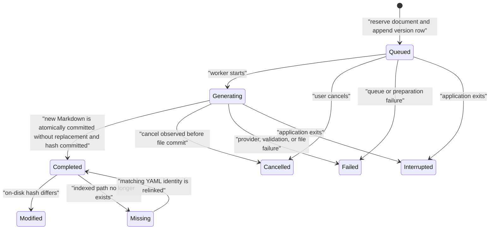

# AI Meeting Documents

- Status: Accepted
- Last updated: 2026-08-22
- Owners: Nota desktop maintainers
- Related code: `src-tauri/src/ai.rs`, `src-tauri/src/storage.rs`,
  `src/components/AiDocumentsPanel.tsx`, `src/components/AiSettingsSection.tsx`
- Related decision:
  [`0005-markdown-first-ai-meeting-documents.md`](decisions/0005-markdown-first-ai-meeting-documents.md),
  [`0011-versioned-transcription-generations.md`](decisions/0011-versioned-transcription-generations.md)

## Scope

AI documents are an optional, explicit post-transcription workflow. A user can
apply a built-in or custom task template to one completed meeting transcript
and produce a shareable Markdown file. Recording and transcription remain
independent of this feature and continue to work without an LLM provider.

The first release includes four built-in templates:

- concise meeting summary;
- meeting action items;
- summary grouped by speaker;
- stand-up and action items grouped by speaker.

Speaker templates require diarized transcript segments. Confirmed participant
names are resolved at generation time without rewriting raw `speaker_N` labels.

## Document and Version Model

An AI document is the stable combination of one recording and one template.
There may be at most one document for that pair. Users who need two variants of
the same scenario clone the template first, which gives the variant its own
document and version selector.

Every generation attempt appends a version ledger row. Every successful
attempt creates a new `.md` file with a monotonically increasing version number;
Nota must never overwrite a previous generated file. The UI opens the newest
completed version by default and lets the user select any earlier version.
Regenerate and revise controls explicitly describe that they create a new
version, and the generation dialog repeats that existing versions and files are
never overwritten.

Generation modes have distinct semantics:

| Mode | Model input | Parent version |
|---|---|---|
| `create` | Current transcript and context | None |
| `regenerate` | Current transcript and context; no previous AI output | None |
| `revise` | Current transcript, current on-disk body of the selected version, and revision request | Selected version |

If a selected Markdown file was edited outside Nota, preview and `revise` use
the current on-disk content. A hash mismatch is displayed as `modified`; it is
not treated as corruption and the file is never rewritten.

## Context Layers

The generation dialog separates context by lifetime:

| Context | Lifetime | Typical content |
|---|---|---|
| Meeting background | Shared by AI documents for this meeting | Project background, acronyms, roles, meeting goal |
| Document requirements | Shared by all versions of this document | Audience, tone, language, length, focus |
| This-run request | Only this version | A one-off emphasis or revision instruction |

The fixed Nota safety policy remains owned by the application. Custom templates
may edit task instructions and output structure, but cannot replace that policy.
Transcript text, background, and an existing Markdown body are delimited as
untrusted source data so instructions embedded in them do not become system
instructions.

## Provider Boundary

Rust owns provider credentials and all LLM HTTP requests. React receives
provider metadata and `hasApiKey`, never the stored key. Technical logs must not
contain credentials, prompt bodies, transcript content, or model output.

- Responses API providers use the user-configured API root (OpenAI's
  `https://api.openai.com/v1` is only the default), append `/responses` when
  needed, put the fixed policy in `instructions`, put the assembled task in
  `input`, and send `store: false`. OpenAI's official endpoint requires an API
  key; third-party endpoints may omit it when their own authentication policy
  allows that.
- OpenAI-compatible providers use non-streaming Chat Completions with separate
  system and user messages.
- The generation dialog can request a read-only preview assembled by the same
  Rust request-body builders used for submission. Responses previews expose
  `instructions` and `input`; Chat Completions previews expose the system and
  user `messages`. Preview payloads never include API keys or authorization
  headers.
- Generation is never automatic. A provider is contacted only after the user
  explicitly submits the generation dialog.
- React uses the `tokenx` dependency to estimate only the model-visible input
  fields in that preview. Responses and Chat Completions use separate field
  adapters over the shared estimator. The same estimate appears on the
  generation-settings and request-preview tabs, is recorded with the version,
  and is checked against the configured input-token budget before submission.
  The estimate remains guidance rather than provider billing truth; successful
  responses retain provider-reported usage when available.
- The read-only JSON preview preserves indentation while wrapping long values
  within the container; users should not need horizontal scrolling to inspect
  `input` or `instructions`.
- A non-empty but incomplete provider response, including a Responses
  `incomplete` status or Chat Completions `finish_reason: length`, fails the
  version instead of publishing a truncated document.
- Every newly reserved version stores the exact request body that Rust will
  send. A successfully completed version also stores the original Provider
  response JSON and normalized input/output usage. Request snapshots never
  include API keys or authorization headers. Response snapshots preserve the
  Provider-controlled JSON verbatim but Nota never adds runtime credentials to
  it. Both snapshots are loaded by React only when the user opens **Generation
  details**.
- The document preview keeps the body visible and opens **Generation details**
  in a right-hand drawer. Generation details shows normalized usage plus separate request and
  response JSON trees. Historical versions created before snapshot persistence
  explicitly report that their original JSON is unavailable.

The initial implementation intentionally does not include transcript chunking,
ACP, autonomous tools, cross-meeting retrieval, or task-system synchronization.
A transcript that exceeds the configured budget is rejected before network
access with guidance to select a larger-context model or reduce supplied
context.

## Lifecycle

The AI manager uses one background worker and prevents concurrent jobs for the
same document. Cancellation is cooperative: a queued job stops before network
access, while an in-flight blocking HTTP request is marked cancelled after the
request returns. The cancellation flag is checked again after the temporary
file is synchronized and immediately before the final no-replace file commit.



The persisted diagnostic exchange follows the same payload used for network
submission; it is not reconstructed later from mutable settings or the current
transcript:

```mermaid
sequenceDiagram
    participant UI as React generation dialog
    participant Rust as Rust AI manager
    participant DB as Local SQLite ledger
    participant LLM as Configured LLM Provider
    participant FS as Versioned Markdown file

    UI->>Rust: submit generation request and token estimate
    Rust->>Rust: assemble request body once
    Rust->>DB: append version and request JSON snapshot
    Rust->>LLM: POST the same request body with runtime authorization
    LLM-->>Rust: raw response JSON
    Rust->>Rust: validate and normalize Markdown plus usage
    Rust->>FS: atomically create new Markdown version
    Rust->>DB: complete version with response JSON and usage
    UI->>Rust: read generation details on demand
    Rust-->>UI: saved JSON; request excludes runtime authorization
```

Successful file commit ordering is:

1. reserve the version ledger row with the exact request JSON;
2. validate the provider response and normalize a Markdown body and usage;
3. assemble Nota YAML identity metadata and the body in memory;
4. write a new same-directory temporary file and call `sync_all`;
5. atomically move it to a previously unused `.md` path with replacement
   disabled, so a concurrently created user file is never overwritten;
6. atomically commit the response JSON, usage, content hash, and `completed`
   status to SQLite;
7. emit the typed status event.

The generated YAML front matter contains opaque Nota document, version, and
recording identities plus generation metadata. It does not contain prompts,
credentials, transcript text, or the provider response outside the document
body.

## File Ownership and Relinking

The default root is `Documents\Nota\AI Documents`. Each meeting receives a
folder based on its title plus a short recording identifier. The directory is
created only when the first successful generation writes a file.
The configured global root is resolved again for every new generation, so
changing it in Settings affects subsequent versions even when that meeting had
generated versions under an older root. Historical versions retain their exact
file paths, and the Explorer action resolves and selects that exact file.

Markdown is the authoritative document content. SQLite is an index and
generation ledger containing associations, status, snapshots, hashes, and
paths, but not a second copy of the generated body. Moving or renaming a file
makes the indexed version `missing`; Nota may scan the configured meeting
folder or let the user choose a file, then relink only when its YAML document
and version identities match.

Deleting a recording preserves associated Markdown files by default. The
confirmation dialog offers an unchecked option to delete exact completed files
that Nota can still associate. Immediately before deletion, Rust requires the
on-disk YAML document and version identities to match the ledger. A moved,
replaced, failed-attempt, or otherwise unverified path is preserved.

## Template Evolution

Built-in templates are seeded with stable identifiers and are not directly
editable or archivable. Users may clone one and edit the clone. A clone inherits
whether diarized speaker labels are required, and custom templates expose that
requirement explicitly. Updating a custom template increments its revision.
Each version snapshots the exact task
instructions, output requirements, provider name/model, speaker-name mapping,
transcription generation, and all three context layers used for that run.

When a recording has multiple completed transcription generations, the
recording-detail version selector determines the current source. Starting an
AI generation reads that exact transcript and stores its generation number in
the AI version ledger. Switching the recording to another transcription later
does not relabel or rewrite an existing AI document version.

Regeneration uses the current template revision. Historical versions retain
their snapshots so future UI and diagnostics can explain how they were made
without depending on the current template text.
