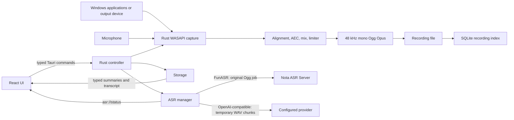

# Nota Client Architecture

- Status: Accepted
- Last updated: 2026-07-31
- Owners: Nota desktop maintainers
- Related code: `src/`, `src-tauri/src/controller.rs`,
  `src-tauri/src/audio/`, `src-tauri/src/storage.rs`, `src-tauri/src/asr.rs`
- Related decisions:
  [`0001-whole-meeting-funasr-jobs.md`](decisions/0001-whole-meeting-funasr-jobs.md)

## Purpose

Nota is a Windows 11 x64 desktop recorder. Reliable local recording is the
primary product capability; transcription is an optional, explicitly
configured post-recording workflow.

The architecture keeps audio, files, SQLite, credentials, and ASR networking in
the Rust backend. React renders typed state and sends commands through Tauri
IPC. It does not receive PCM audio or read stored API keys.

## Runtime Overview

## Component Ownership

| Component | Owns | Must not own |
|---|---|---|
| React and TypeScript | Rendering, user intent, typed IPC calls, transient form input | PCM, direct recording files, SQLite, stored credentials, ASR HTTP |
| Tauri controller | Command boundary, application lifecycle, tray and shortcut integration | Provider-specific transcript normalization |
| Audio pipeline | Capture scope, clock alignment, AEC, mixing, Opus encoding, recovery | Network access or transcript state |
| Storage | Settings, recording index, provider snapshots, transcription state and results | Audio capture or HTTP retry policy |
| ASR manager | Queueing, cancellation, provider protocol selection, retry and result normalization | UI rendering or raw credential disclosure |
| Configured ASR service | Model inference and server-side processing | Local recording ownership |

## Non-Negotiable Invariants

- Recording must work without network access.
- Network access occurs only for an explicit transcription or when automatic
  transcription is enabled.
- A selected application capture failure must be reported; Nota must not
  silently widen capture to all system audio.
- Only one recording may be active.
- Recording controls and recovery actions must remain idempotent.
- The original Ogg recording is never replaced by transcription intermediates.
- A transcript is complete only after its final result is durable in local
  SQLite.
- API keys, authorization headers, audio, and transcript content must not enter
  technical logs.
- Rust and TypeScript IPC models must change together.

## Concurrency and Lifecycle

The recording controller owns the single active recording. The ASR manager uses
one background worker thread and a queue, so desktop-side transcription jobs are
processed sequentially. A per-recording cancellation registry prevents the
same recording from being enqueued twice.

If transcription is requested while recording is active, the ASR worker waits
until recording stops. On application startup, locally queued, preparing, or
transcribing records are marked `interrupted`; the user can explicitly resume
them.

User cancellation and application shutdown differ:

- User cancellation requests remote cancellation for FunASR and leaves the
  local job resumable.
- Application shutdown interrupts local work without intentionally cancelling
  the remote FunASR job. A later resume can recover server progress.

## Trust Boundaries

The local SQLite database and recording directory contain private meeting data.
Configured ASR providers are external trust boundaries even when they run on
localhost or the LAN.

Provider responses are normalized into Nota-owned types before reaching the
frontend. Technical logs may include opaque recording identifiers and state
names, but never credentials, audio, or transcript text.

## Change Impact

Changes to provider selection, transcription state, progress, IPC fields, or
result persistence are cross-layer changes. They normally require coordinated
updates to:

- `src-tauri/src/models.rs`;
- `src-tauri/src/storage.rs`;
- `src-tauri/src/asr.rs`;
- `src/types.ts`;
- the affected React component and tests;
- [`asr-integration.md`](asr-integration.md) or
  [`data-lifecycle.md`](data-lifecycle.md).
