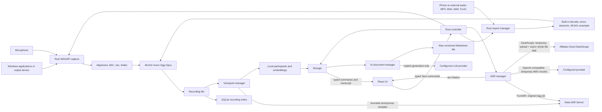
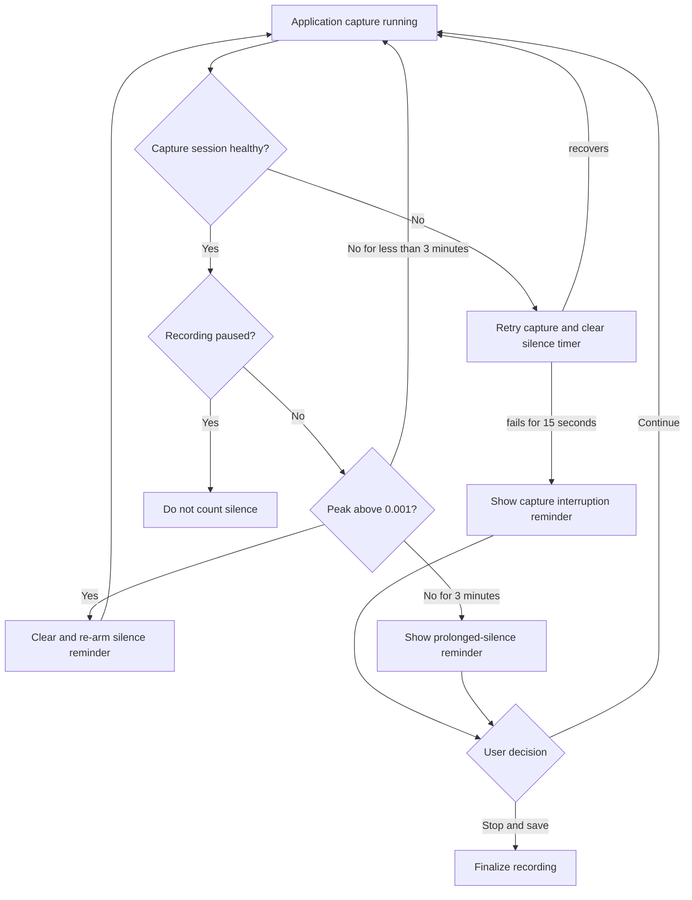
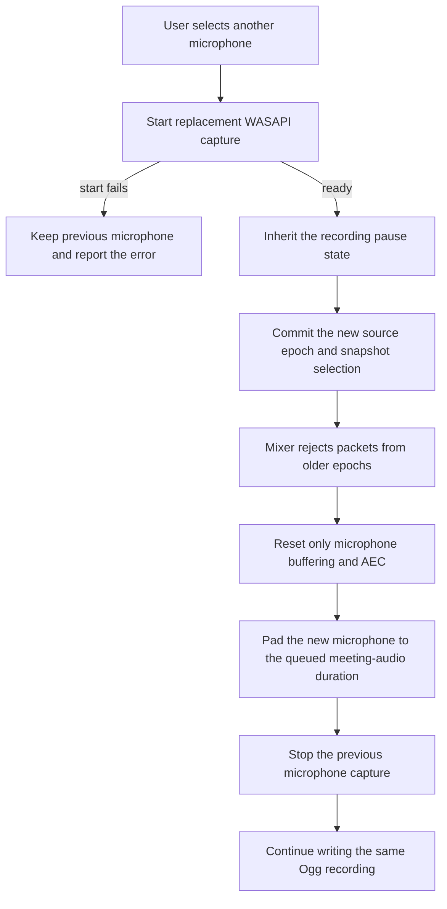

# Nota Client Architecture

- Status: Accepted
- Last updated: 2026-08-22
- Owners: Nota desktop maintainers
- Related code: `src/`, `src-tauri/src/controller.rs`,
  `src-tauri/src/audio/`, `src-tauri/src/storage.rs`, `src-tauri/src/asr.rs`,
  `src-tauri/src/importer.rs`, `src-tauri/src/voiceprints.rs`,
  `src-tauri/src/ai.rs`
- Related decisions:
  [`0001-whole-meeting-funasr-jobs.md`](decisions/0001-whole-meeting-funasr-jobs.md),
  [`0010-direct-dashscope-file-transcription.md`](decisions/0010-direct-dashscope-file-transcription.md),
  [`0005-markdown-first-ai-meeting-documents.md`](decisions/0005-markdown-first-ai-meeting-documents.md),
  [`0008-local-privacy-safe-diagnostic-logs.md`](decisions/0008-local-privacy-safe-diagnostic-logs.md)

## Purpose

Nota is a Windows 11 x64 desktop recorder. Reliable local recording is the
primary product capability; transcription is an optional, explicitly
configured post-recording workflow.

The architecture keeps audio, files, SQLite, credentials, and ASR networking in
the Rust backend. React renders typed state and sends commands through Tauri
IPC. It does not receive PCM audio or read stored API keys.

## Runtime Overview

## Component Ownership

| Component | Owns | Must not own |
|---|---|---|
| React and TypeScript | Rendering, user intent, typed IPC calls, transient form input | PCM, direct recording files, SQLite, stored credentials, ASR HTTP |
| Tauri controller | Command boundary, application lifecycle, tray and shortcut integration | Provider-specific transcript normalization |
| Audio pipeline | Capture scope, clock alignment, AEC, mixing, Opus encoding, recovery | Network access or transcript state |
| Audio import manager | Local file validation, exact-file deduplication, decode/resample, managed Ogg creation, cancellation, and crash cleanup | Source-file mutation, network access, ASR, or UI rendering |
| Storage | Settings, recording index, provider snapshots, transcription state and results | Audio capture or HTTP retry policy |
| ASR manager | Queueing, cancellation, provider protocol selection, durable checkpoints, and final commit | UI rendering or raw credential disclosure |
| ASR provider adapter | Provider HTTP, upload validation, task/result parsing, and normalization into Nota transcript types | Queue ownership, React state, or SQLite credentials outside the active request |
| Voiceprint manager | Timestamp candidate planning, bounded Ogg sampling, clean-range response mapping, local matching, and confirmation sessions | Participant-name disclosure to the ASR Server or raw-vector disclosure to React |
| AI document manager | Prompt assembly, LLM requests, cancellation, version lifecycle, atomic Markdown creation, and relinking | Automatic generation, transcript mutation, or in-place overwrite of generated files |
| Configured ASR service | Model inference and server-side processing | Local recording ownership |
| Configured LLM provider | Explicitly requested text generation | Local Markdown, SQLite, or recording ownership |

## Non-Negotiable Invariants

- Recording must work without network access.
- Network access occurs only for an explicit transcription or when automatic
  transcription is enabled.
- A selected application capture failure must be reported; Nota must not
  silently widen capture to all system audio.
- Only one recording may be active.
- Recording capture and audio import must not run at the same time.
- Imported source files are read-only inputs; Nota owns only the normalized Ogg copy.
- Recording controls and recovery actions must remain idempotent.
- The original Ogg recording is never replaced by transcription intermediates.
- A transcript is complete only after its final result is durable in local
  SQLite.
- Cloud Provider capabilities and voiceprint support are snapshotted per
  transcription generation; changing the default Provider cannot rewrite
  historical feature availability.
- API keys, authorization headers, audio, and transcript content must not enter
  technical logs.
- Rust and TypeScript IPC models must change together.
- Raw transcript speaker labels remain immutable; confirmed real names are
  resolved from generation-scoped local assignments.
- AI generation must be explicit and must not modify the transcript or a
  previously generated Markdown version.
- Generated Markdown is authoritative content; SQLite stores its association
  and version ledger rather than a duplicate body.

## Concurrency and Lifecycle

The recording controller owns the single active recording. The ASR manager uses
one background worker thread and a queue, so desktop-side transcription jobs are
processed sequentially. A per-recording cancellation registry prevents the
same recording from being enqueued twice.

If transcription is requested while recording is active, the ASR worker waits
until recording stops. On application startup, locally queued, preparing, or
transcribing records are marked `interrupted`; the user can explicitly resume
them.

The audio import manager owns one sequential, cancellable batch. Recording
start rejects while import is active, and import start rejects while recording
is active. ASR and AI work remain independent because import performs only
local bounded-buffer media conversion. A failed item does not stop later items
in the batch. Application shutdown cancels and joins the importer before exit;
startup either completes an already durable file commit or removes an
uncommitted partial file. Source decoding itself is restarted rather than
resumed after a crash.

For ASR, user cancellation and application shutdown differ:

- User cancellation requests remote cancellation for FunASR and leaves the
  local job resumable.
- DashScope cancellation is remote only while `PENDING`. During `RUNNING`,
  Nota stops local polling, retains the task id, and reports that cloud work
  may continue; resume queries that same task.
- Application shutdown interrupts local work without intentionally cancelling
  the remote FunASR job. A later resume can recover server progress.

The AI document manager has a separate single background worker. It serializes
LLM jobs, rejects concurrent work for the same document, and marks locally
queued or generating versions `interrupted` on application startup. AI versions
are not resumed implicitly because a retry must append a new Markdown version.
Cancellation is checked before request dispatch and again before the new file
is committed.

## Selected-application Capture Reminders

Nota does not attempt to infer whether a third-party meeting has ended. Window
visibility, process lifetime, titles, layout changes, and screen sharing are
not reliable meeting-liveness signals. A reminder describes an observable
audio condition and must not claim that the meeting ended.

The audio layer reports two conditions that Nota can verify:

- **Capture interruption:** selected-application WASAPI process-loopback
  capture cannot be rebuilt continuously for 15 seconds. A single
  capture-session failure begins the grace period; a successful restart clears
  it.
- **Prolonged silence:** while an application capture is running and not
  paused, no sample peak exceeds `0.001` (approximately `-60 dBFS`) for three
  continuous minutes. The timer restarts after pause, capture reconstruction,
  or audible audio. This is a reminder only; silence is not evidence that the
  meeting ended.

When either threshold expires, the controller stores a session-scoped pending
decision, shows a Tauri always-on-top prompt, and changes the tray state. Nota
must not stop recording without an explicit user decision. Capture recovery
automatically dismisses an interruption prompt; audible audio automatically
dismisses a silence prompt. Choosing **Continue** clears only the current UI
decision. The same uninterrupted condition does not generate another prompt:
capture must recover before another interruption reminder, and audible audio
must return before another silence reminder.

The continue action only clears the pending decision. It must not change the
selected scope, microphone state, mixer state, or recording state. It does not
trigger capture reconstruction because the audio layer already owns automatic
retries. Prompt actions carry the recording session ID; stale actions from an
older recording are ignored.

The prompt is intentionally a Tauri window rather than a Windows notification
API dependency. This keeps NSIS and portable builds behaviorally identical and
allows both decisions to reach the existing Rust controller. The tray remains
the durable re-entry point if the prompt is dismissed or obscured. The prompt
measures its rendered content and requests a bounded `170–320` logical-pixel
height from Rust; Rust then resizes and re-anchors it at the monitor's lower
right corner. Content beyond the upper bound remains scrollable, so DPI,
accessibility text scaling, long target titles, and error details cannot hide
the decision buttons.

## Live Microphone Switching

An active recording may replace or disable only its microphone source. The
meeting-audio selection remains immutable for the session: a microphone change
must not switch the selected application, widen capture to system audio, or
start a second recording file. `RecordingSnapshot.microphoneSelection` is the
authoritative current selection exposed to React; changing it is session-scoped
and does not rewrite the saved default recording preference.

Replacement uses a make-before-break handoff. Each microphone capture instance
stamps packets with a monotonically changing source epoch. Rust starts and
validates the requested device before publishing its epoch. The mixer accepts
only the committed epoch, so packets arriving late from the previous capture
cannot be mixed into the new device. A failed replacement leaves the previous
epoch and capture handle unchanged.

Resetting the microphone must not discard already queued meeting audio. The new
microphone begins with bounded silence matching the current meeting-audio
buffer, after which both streams resume their normal clock-drift correction.
AEC returns to `converging` and becomes `enabled` only after two seconds of
actual post-switch processing. Disabling the microphone clears its pending
audio and disables AEC. Switching while paused validates the replacement with
a complete WASAPI `Start`/`Stop`/`Reset` cycle before committing it in the
paused state. On resume, the mixer and microphone-only DSP state are reset
before any resumed packets are dequeued, then both captures resume together.

Opening a Bluetooth microphone may change the Windows A2DP/HFP device mode. In
system-audio recording mode, Rust therefore rebuilds the existing system
loopback after the microphone handoff while preserving the same selected
endpoint policy. It must never fall back to another capture scope silently.

## Trust Boundaries

The local SQLite database and recording directory contain private meeting data.
Configured ASR providers are external trust boundaries even when they run on
localhost or the LAN.

Configured LLM providers are a separate external trust boundary. Only an
explicit generation action sends the current transcript, supplied context, and
for `revise` the selected Markdown body. Provider connection tests never send
meeting content. OpenAI requests set `store: false`, but the interface must not
describe that flag as a zero-retention guarantee.

Provider responses are normalized into Nota-owned types for ordinary product
state. The explicit AI **Generation details** read path may additionally return
the locally persisted raw request and response JSON for one selected version.
That path is on demand and never adds runtime authorization or API keys to the
saved request. The raw response remains Provider-controlled data. Neither
payload may be written to technical logs. Technical logs may include
opaque recording identifiers and state names, but never credentials, audio,
transcript text, request bodies, or model output.

LLM responses are also normalized in Rust. Technical logs must not contain the
assembled prompt or generated body. React previews Markdown without raw HTML
and does not automatically load remote images.

## Change Impact

Changes to provider selection, transcription state, progress, IPC fields, or
result persistence are cross-layer changes. They normally require coordinated
updates to:

- `src-tauri/src/models.rs`;
- `src-tauri/src/storage.rs`;
- `src-tauri/src/asr.rs`;
- `src/types.ts`;
- the affected React component and tests;
- [`asr-integration.md`](asr-integration.md) or
  [`data-lifecycle.md`](data-lifecycle.md).
