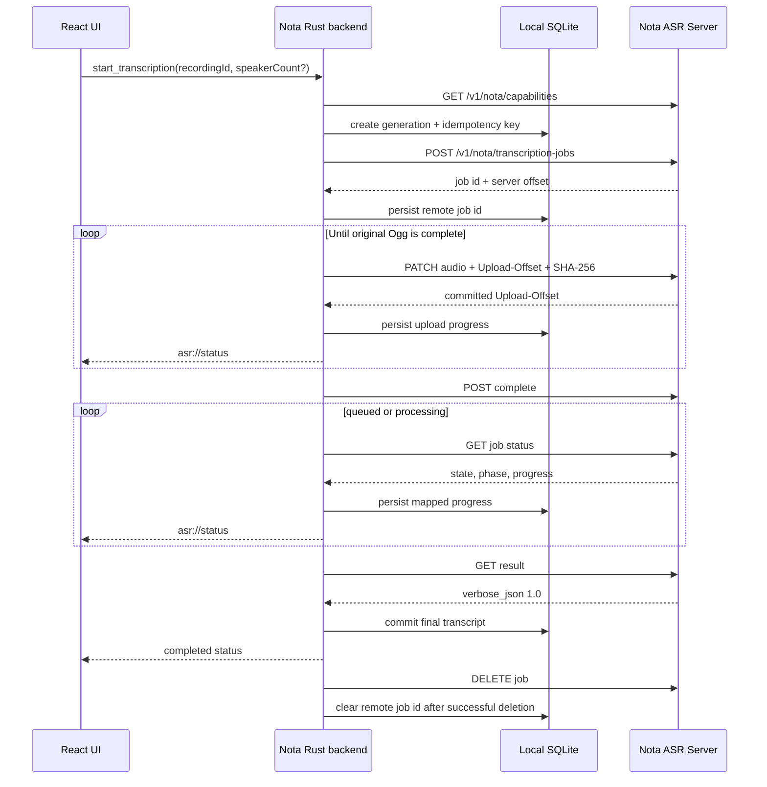

# ASR Integration Specification

- Status: Accepted
- Last updated: 2026-08-04
- Owners: Nota desktop and Nota ASR Server maintainers
- Related code: `src-tauri/src/asr.rs`, `src-tauri/src/models.rs`,
  `src-tauri/src/storage.rs`, `src/components/RecordingsWorkspace.tsx`
- Related tests: Rust `asr::tests`, Rust `storage::tests`,
  `src/components/RecordingsWorkspace.test.tsx`
- Related decision:
  [`0001-whole-meeting-funasr-jobs.md`](decisions/0001-whole-meeting-funasr-jobs.md)

## Scope

Nota supports two deliberately different transcription protocols.

| Provider kind | Protocol | Uploaded audio | Speaker scope |
|---|---|---|---|
| `funAsr` | `nota_batch_v1` | Original 48 kHz Ogg Opus, resumable byte upload | Whole final meeting |
| `openAiCompatible` | `legacy_chunks` | Temporary 16 kHz mono WAV chunks | One provider request per chunk |

The provider kind selects the protocol when a new local transcription
generation begins. Existing records migrated from older Nota versions remain
`legacy_chunks`.

The durable protocol is model-independent: SenseVoice, Paraformer, and
Fun-ASR-Nano may be selected by provider model id while retaining the same
client-visible transcript types. Model-specific VAD, punctuation, and speaker
segmentation remain server-owned. OpenVINO and realtime transcription are
outside this specification.

## FunASR Capability Gate

Before creating a FunASR transcription, Nota calls:

```text
GET /v1/nota/capabilities
```

The server must advertise:

- `batch_transcription_version` equal to `"1"`;
- `ogg` in `audio_formats`;
- a positive `upload_chunk_bytes`;
- upload size and audio-duration limits.

Nota rejects an old or incompatible server. It must not silently fall back to
independent WAV transcription requests because that would change the promised
speaker scope.

The connection test may still report the server as reachable, but its level is
`warning` and the message explains that a server upgrade is required.

## Whole-Meeting Request

For each new FunASR generation, Nota creates a persistent UUID
`Idempotency-Key` and submits:

```json
{
  "file_name": "meeting.ogg",
  "content_type": "audio/ogg",
  "size_bytes": 123456,
  "model": "sensevoice",
  "language": "auto",
  "response_format": "verbose_json",
  "diarization": true,
  "speaker_count": null
}
```

Language remains automatic and diarization remains enabled. Before a manual
FunASR start or retranscription, the desktop asks whether the server should
detect the speaker count automatically or use a known count from 1 through 64.
Automatic detection is the default. The selected nullable value is a per-job
snapshot, not a global preference. Automatic transcription always stores and
sends `speaker_count=null` without showing the dialog.

OpenAI-compatible manual transcription does not show speaker-count controls
and rejects a non-null count at the Rust boundary. An incorrect known count can
merge different speakers or split one speaker; the client validates only the
1–64 range and does not silently replace an accepted value.

The server-provided upload chunk size is authoritative, with a defensive
client-side maximum of 16 MiB. Nota also rejects a recording that exceeds the
advertised byte or duration limits before uploading it.

## Protocol Sequence



## Upload Rules

- Nota reads the original Ogg directly; it does not create FunASR WAV chunks.
- Each PATCH contains one continuous range and
  `Upload-Checksum: sha256=<hex>`.
- The server's `Upload-Offset` is the source of truth.
- On HTTP 409 with a valid server offset, Nota seeks to that offset and
  continues.
- A successful response must advance exactly by the sent byte count.
- An offset beyond the local file size, a mismatched declared upload length,
  or a malformed success offset fails the local job.
- The local recording remains untouched after success, failure, cancellation,
  and retry.

## State Mapping

The remote protocol and local UI do not use identical state names. The mapping
is intentional:

| Remote state | Remote phase | Local status | Local progress phase | Unit |
|---|---|---|---|---|
| `uploading` | `uploading` | `preparing` | `uploading` | `bytes` |
| `queued` | `queued` | `queued` | `queued` | server-provided |
| `processing` | `transcribing` | `transcribing` | `transcribing` | normally `windows` |
| `processing` | `diarizing` | `transcribing` | `diarizing` | normally `steps` |
| `processing` | `finalizing` | `transcribing` | `finalizing` | normally `steps` |
| `succeeded` | any | `transcribing` until local commit | `finalizing` | `steps` |

After the result is committed locally, status becomes `completed` and
`progress_phase` becomes null. Remote `failed` and `cancelled` states become
resumable local errors.

The UI presents semantic phases rather than exposing server implementation
terms:

- Upload recording
- Waiting in server queue
- Processing audio windows
- Reconciling speakers
- Finalizing result

## Cancellation, Interruption, and Resume

User cancellation:

1. sets the local cancellation flag;
2. starts a best-effort remote cancel without blocking the UI;
3. records local status `cancelled`;
4. preserves the local remote job identity and all server checkpoints.

The server may finish its current bounded inference window before cancellation
becomes terminal. Resume tolerates `job_still_stopping` by polling until the
remote job can continue.

Application shutdown marks active local jobs `interrupted` but does not request
remote cancellation. On resume, Nota queries the persisted remote job:

- existing `uploading` jobs continue from the server offset;
- existing `queued` or `processing` jobs resume polling;
- existing `cancelled` or `failed` jobs receive `POST resume`;
- existing `succeeded` jobs fetch their result;
- missing or expired jobs are recreated and uploaded from byte zero.

The local generation's snapshotted `speaker_count` is reused for every remote
recreation. Resume never reads a current UI value or a global setting.

## Result Commit and Cleanup

`GET result` does not acknowledge deletion.

Nota must commit the normalized transcript to local SQLite before sending
`DELETE`. A cleanup failure does not roll back the local completed state. The
remote job id remains available for later best-effort cleanup, and the server
also applies its configured retention fallback.

Starting a new transcription creates a new local generation and idempotency
key. Any previous remote job is cleaned up best-effort and must never be reused
as the new generation.

## OpenAI-Compatible Legacy Flow

The legacy flow remains available only for `openAiCompatible` providers:

- decode the archived Ogg locally;
- resample to 16 kHz mono PCM;
- create ten-minute WAV chunks with two seconds of overlap;
- send each chunk to `POST /v1/audio/transcriptions`;
- persist completed chunks in local SQLite;
- skip persisted chunks when resuming;
- merge text and timestamps while removing overlap duplicates;
- delete every temporary WAV after its request.

Nota requests `verbose_json`. It retries with compact `json` only when the
provider explicitly rejects `response_format`; authentication, rate-limit, and
server failures are not retried as format fallbacks.

Each legacy chunk is a separate provider request. Speaker labels from that path
must not be described as meeting-wide identities.

## Compatibility Invariants

- `TranscriptDocument` and `TranscriptionSummary` remain provider-independent.
- Final transcript segments use milliseconds locally and optional anonymous
  speaker labels.
- Optional speaker identification is a separate post-transcription request.
  It requires `speaker_sample_analysis_version=1`, sends repeated bounded
  candidates for one anonymous speaker to
  `/v1/nota/speaker-samples/analyze`, keeps names and matching local, and must
  not change normal transcription completion or retry semantics. See
  `speaker-identification.md`.
- Clipboard copying and TXT export use the same Rust formatter. If any segment
  has a non-empty speaker label, every non-empty segment is written on its own
  line with the confirmed local participant name when available, otherwise
  the raw `speaker_N` label; unlabeled segments are not assigned an invented
  identity. Without speaker labels, the normalized plain transcript is
  preserved.
- The frontend does not parse provider HTTP responses.
- The existing OpenAI-compatible workflow must continue to work when FunASR
  evolves.
- A future batch protocol change requires capability negotiation rather than
  silently changing version 1 semantics.

## Security and Logging

Bearer keys are attached only inside the Rust HTTP client. Stored provider
reads expose `hasApiKey`, not the key value. HTTP errors shown to the user are
bounded and secrets are redacted.

Technical logs may identify the recording and generation, but must not include
authorization headers, audio bytes, transcript bodies, or provider responses
that could contain transcript content.
