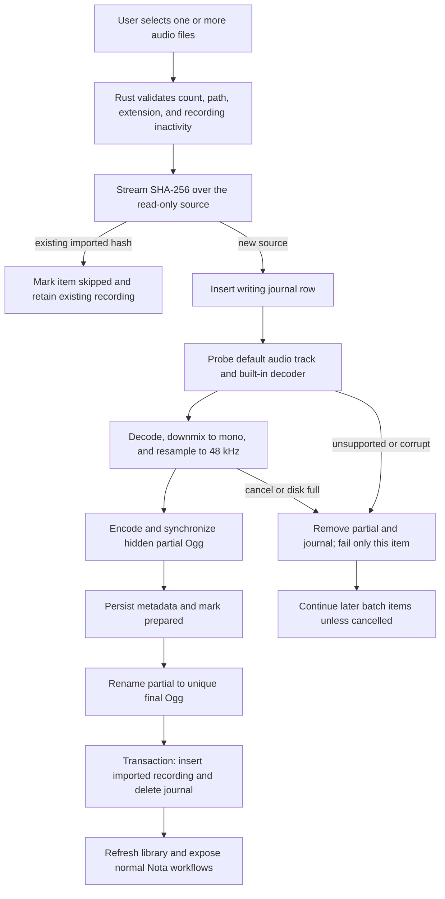

# Audio Import

- Status: Accepted
- Last updated: 2026-08-11
- Owners: Nota desktop maintainers
- Related code: `src-tauri/src/importer.rs`, `src-tauri/src/storage.rs`,
  `src-tauri/src/controller.rs`, `src/components/RecordingsWorkspace.tsx`
- Related decision:
  [`0007-normalize-imported-audio-to-managed-ogg.md`](decisions/0007-normalize-imported-audio-to-managed-ogg.md)

## Purpose and Scope

Audio import brings recordings made on a phone or another device into the
normal Nota recording library. After import, playback, transcription, speaker
management, transcript export, and AI documents use the same code paths as a
captured meeting.

The first version accepts MP3, M4A, WAV, and FLAC. M4A supports AAC-LC and ALAC
through built-in Rust decoders. HE-AAC, DRM/protected media, video containers,
and arbitrary FFmpeg formats are intentionally unsupported. Import is local
and does not start transcription or any network request.

## Ownership and Normalization

The selected source is a read-only input and remains owned by the user. Nota
creates a new, uniquely named 48 kHz mono Ogg Opus file in the configured
recording directory. It downmixes multichannel input, resamples in bounded
chunks, and uses the existing Nota Opus writer. No FFmpeg executable, codec
pack, PATH configuration, or runtime DLL is required.

The recording title comes from the source file stem. The displayed meeting
time uses the source modification time when plausible and otherwise the import
time. SQLite records `origin = imported`, original file name, source format,
import time, and an internal SHA-256. The external source path is used only by
the temporary import journal and is removed from SQLite when the commit ends.

Exact source bytes are imported once while their imported recording row exists.
Selecting the same bytes under another name is reported as skipped and opens
the existing recording identity. Deleting that recording permits a later
reimport. This is exact-file deduplication, not perceptual audio matching.

## Processing Flow

## Batch State and Interaction

One import batch runs sequentially with at most 100 selected files. Its public
states are `running`, `completed`, and `cancelled`; item states are `queued`,
`probing`, `decoding`, `finalizing`, `completed`, `failed`, `skipped`, and
`cancelled`. React receives snapshots and renders the current file, decoded
duration progress when available, terminal counts, and the first failure.

Stopping a batch cooperatively cancels the current hash/decode operation and
marks queued items cancelled. Already completed imports remain in the library.
An individual corrupt or unsupported file fails without stopping later files.
At least 64 MiB must remain in the destination during conversion.

Recording and import are mutually exclusive because both create managed media
in the recording workflow. Import does not block playback, transcription, or
AI work for recordings already present. Automatic transcription applies to
newly captured recordings only; imported recordings require an explicit
transcription action.

## Crash and Delete Semantics

The private `audio_import_jobs` table is a filesystem/SQLite commit journal.
On startup, Nota completes a prepared file that was already synchronized or
renamed. Any earlier incomplete partial is removed. Decoding is not resumed
from a source offset after a crash; the user can select the source again.

Deleting or recycling an imported recording operates on the managed Ogg and
the normal dependent SQLite rows. It must never delete, move, or rewrite the
original selected file. The confirmation dialog states this distinction.

## Privacy and Logging

The importer performs no network access. Source paths, file names, hashes,
audio bytes, and derived audio must not be added to technical logs. React may
receive the original display file name and format for the recording detail,
but never receives the source hash or decoded PCM.
