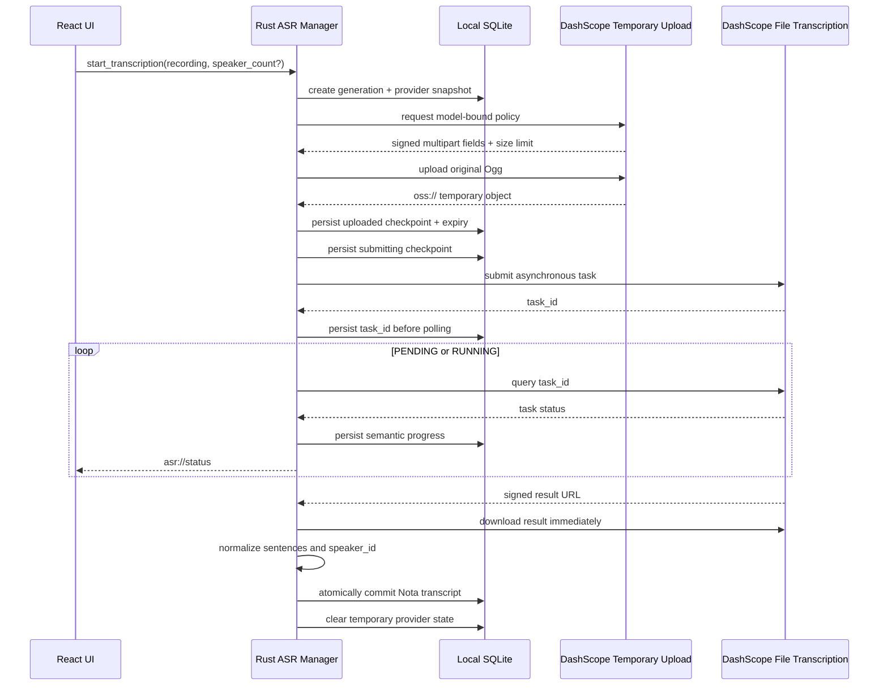
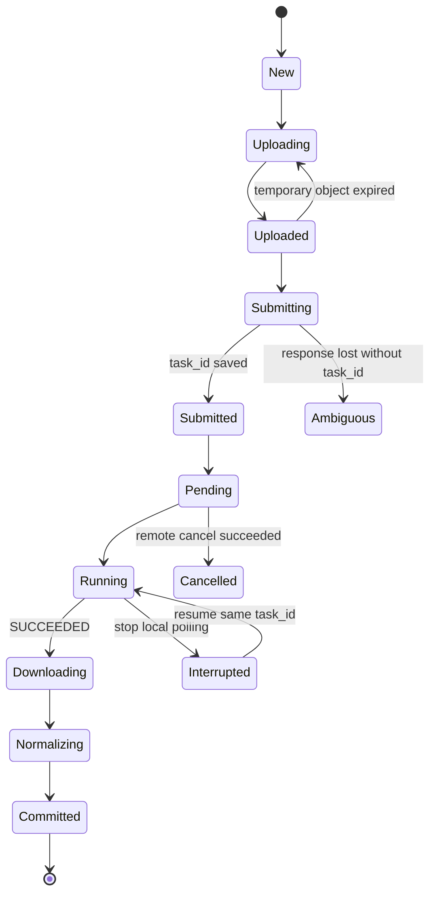

# DashScope File Transcription Provider

- Status: Accepted
- Last updated: 2026-08-22
- Owners: Nota maintainers
- Related code: `src-tauri/src/asr/`, `src-tauri/src/models.rs`,
  `src-tauri/src/storage.rs`, `src/components/SettingsWorkspace.tsx`, and
  `src/components/SpeakerIdentificationModal.tsx`
- Related decision:
  [`0010-direct-dashscope-file-transcription.md`](decisions/0010-direct-dashscope-file-transcription.md)

## Purpose and Boundary

Nota connects directly from its Rust backend to Alibaba Cloud DashScope for
whole-recording transcription. React sends user intent through typed IPC but
never reads the recording, stored API key, temporary object URL, provider task
response, or raw transcript payload. Nota ASR Server remains the self-hosted
inference and voiceprint-extraction service; it is not a DashScope proxy.

The first supported configuration is deliberately fixed:

| Setting | Value |
|---|---|
| API root | `https://dashscope.aliyuncs.com/api/v1` |
| Model | `qwen-audio-3.0-asr-flash-filetrans` |
| Input | One original Nota Ogg recording |
| Language | Automatic detection |
| Speaker diarization | Always enabled |
| Speaker count | Automatic or a reference value from 2 through 100 |
| Reliable duration | At most two hours while diarization is enabled |
| Upload | DashScope model-bound temporary object, retained for about 48 hours |

The model returns meeting-local anonymous labels such as `speaker_0`; it does
not participate in Nota voiceprint analysis or cross-meeting identity matching.
Users may still preview representative utterances and assign local names.

## Provider Capabilities

Provider behavior is exposed as typed capabilities instead of being inferred
through repeated provider-kind checks in React. Capabilities cover whole-file
processing, diarization, speaker-count limits, voiceprint analysis, model
discovery, cloud upload, and the reliable duration limit.

Capabilities are snapshotted with each transcription generation. Changing the
current default provider must not change the behavior of an existing transcript:

- a DashScope generation never permits Nota voiceprint analysis;
- a FunASR generation may still use the separately configured voiceprint
  provider after the default transcription provider changes;
- retranscription creates a new generation and snapshots the newly selected
  provider capabilities.

## Runtime Flow

## Durable State and Recovery

`transcriptions.provider_kind` stores the generation provider snapshot.
`transcriptions.provider_state_json` stores a versioned, provider-private
checkpoint. DashScope uses the existing `remote_job_id` for `task_id` and the
checkpoint for the current stage, the temporary object reference and expiry,
and the submit-attempt time.

Recovery rules are conservative about duplicate billing:

- a valid uploaded object may be reused before task submission;
- an expired object is uploaded again;
- a saved `task_id` is queried and is never resubmitted;
- a `submitting` checkpoint without `task_id` is ambiguous and cannot retry
  automatically because DashScope has no Nota idempotency key;
- an expired or `UNKNOWN` task requires an explicit fresh transcription;
- provider URLs are removed after the normalized transcript is durable.

Only a `PENDING` DashScope task can be cancelled remotely. A `RUNNING` task is
interrupted locally, retains its task id, and may continue incurring provider
work. Resuming queries that same task.

## Result Normalization

The adapter accepts only the documented file-transcription result shape. It
maps every sentence to one `TranscriptSegment`:

- `begin_time` to `startMs`;
- `end_time` to `endMs`;
- `text` without semantic rewriting;
- numeric `speaker_id` to `speaker_N`.

Segments are ordered by timestamps, invalid ranges are rejected, and full text
uses the provider transcript text with sentence text as a validated fallback.
Provider word timestamps are parsed only as bounded input validation in the
first release and are not added to the public Nota transcript schema.

## Product Interaction

DashScope settings expose only a local display name and API key. The API root
and model are visible but read-only. Connection testing obtains an upload
policy without uploading audio or creating a billed transcription task.

The settings and transcription-options surfaces explain that a complete
recording is uploaded to Alibaba Cloud. Automatic transcription repeats that
the upload begins after recording finalization. Recordings longer than two
hours are rejected before network access because speaker diarization is always
enabled.

Speaker management remains available for DashScope transcripts, but its banner
states that Nota voiceprint analysis is unsupported for that generation.
Representative playback and manual names remain enabled. Voiceprint analysis
and enrollment controls remain unavailable even when a separate FunASR
voiceprint provider is configured.

## Security and Diagnostics

- The API key remains in the existing local SQLite provider record and is
  exposed to React only as `hasApiKey`.
- Upload hosts and result URLs must use HTTPS Alibaba Cloud hosts.
- Technical logs may contain provider kind, model, phase, HTTP status, bounded
  error codes, recording id, and generation.
- Logs must not contain API keys, authorization headers, audio, transcript
  text, temporary object URLs, signed result URLs, request bodies, or provider
  response bodies.
- The temporary upload cannot be deleted early; cancellation relies on its
  provider-managed expiry.

## Acceptance

Automated tests use mock HTTP services and cover request headers and multipart
shape, URL validation, limits, normalization, recovery, ambiguous submission,
remote cancellation, local interruption, migrations, UI capability messaging,
and regressions for existing providers. Automated tests never call DashScope.

Manual acceptance uses the ignored `examples/dashscope-filetrans/sample.ogg`
and confirms upload, asynchronous polling, sentence timestamps, anonymous
speakers, local commit, resume without duplicate submission, and privacy-safe
logs.

## Checklist for Another Third-Party ASR Provider

1. Add a distinct provider kind and protocol; do not overload OpenAI
   compatibility when the lifecycle or result semantics differ.
2. Define capabilities and snapshot the provider kind with each generation.
3. Keep raw audio, credentials, HTTP, normalization, and provider checkpoints
   in Rust; React receives typed capabilities, states, and normalized results.
4. Specify upload ownership, retention, maximum input, timeouts, host
   validation, cancellation, result expiry, and whether submission is
   idempotent.
5. Persist the remote identity before polling and define every crash boundary,
   including an ambiguous submit response.
6. Normalize timestamps, text, language, and anonymous speaker labels into
   Nota-owned types without leaking provider payloads into technical logs.
7. Drive configuration, speaker-count controls, cloud disclosure, and feature
   degradation from capabilities and the generation snapshot.
8. Add mock protocol tests, migration tests, UI tests, manual acceptance, an
   ADR for the durable boundary, and updates to the owning specifications.
