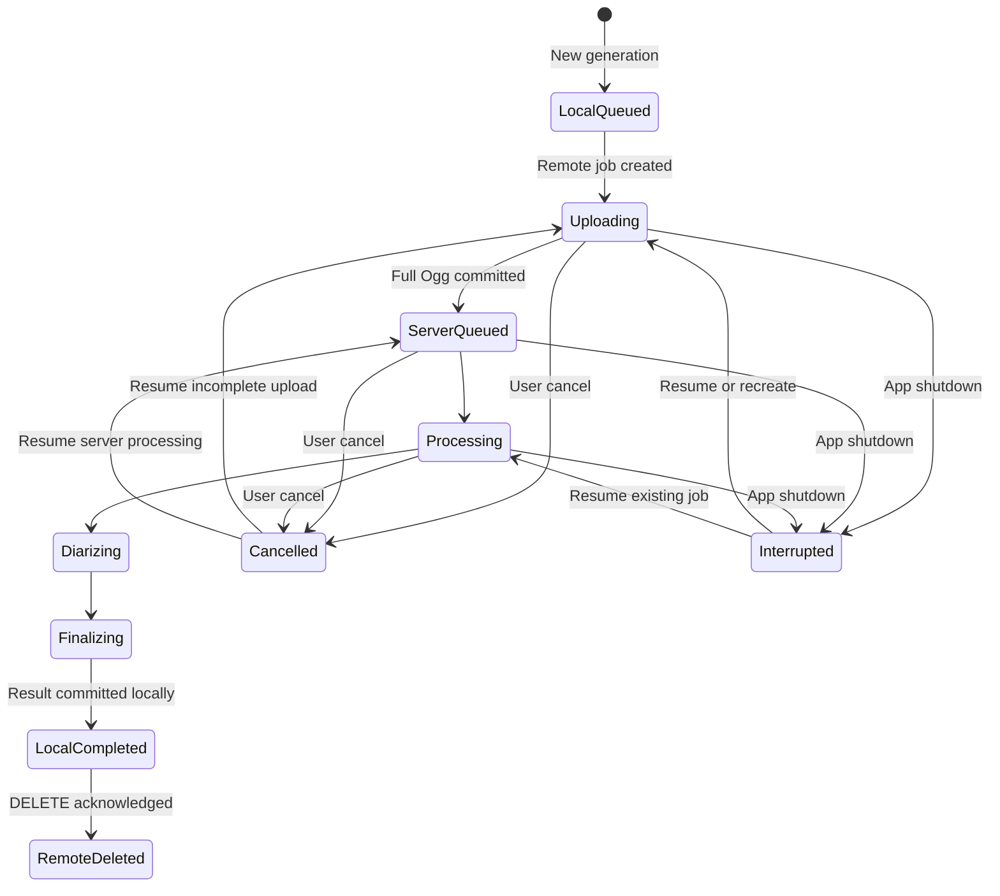

# Recording, Transcription, and AI Document Data Lifecycle

- Status: Accepted
- Last updated: 2026-08-12
- Owners: Nota desktop maintainers
- Related code: `src-tauri/src/paths.rs`, `src-tauri/src/storage.rs`,
  `src-tauri/src/asr.rs`, `src-tauri/src/ai.rs`, `src-tauri/src/importer.rs`,
  `src-tauri/src/audio/recovery.rs`
- Related tests: Rust `storage::tests`, `asr::tests`, and `paths::tests`

## Data Classes

| Data | Location | Lifetime |
|---|---|---|
| Captured final Ogg recording | User-selected recording directory | Until the user deletes or moves it |
| Imported source audio | User-selected external path | Never owned or modified by Nota |
| Imported normalized Ogg copy | User-selected recording directory | Until the user deletes or moves the Nota copy |
| Audio import partial Ogg | User-selected recording directory, hidden `.nota-import-*.partial.ogg` | One import attempt; removed on failure/cancel or reconciled at startup |
| Audio import commit journal | Local SQLite `audio_import_jobs` | Until the managed Ogg and recording row are atomically reconciled |
| Recovery Ogg | Nota recovery directory | Until recovery, discard, or successful finalization |
| Settings and recording index | Local SQLite | Application lifetime |
| ASR provider API key | Local SQLite, Rust access only | Until replaced, cleared, or provider deletion |
| Local transcript and segments | Local SQLite | Until retranscription or recording deletion |
| Participant names and confirmed meeting assignments | Local SQLite, Rust access only | Until participant, assignment, or recording deletion |
| CAM++ voiceprint embeddings | Local SQLite BLOB, Rust access only | Until sample or participant deletion |
| Voiceprint candidate WAVs | Recovery `VoiceprintTemp` directory | One clean-sample analysis request; stale files are removed at startup |
| Legacy temporary WAV | Recovery `TranscriptionTemp` directory | One provider request; stale files are removed at startup |
| Remote FunASR upload and checkpoints | Nota ASR Server data directory | Until client DELETE or server retention expiry |
| LLM provider API key | Local SQLite, Rust access only | Until replaced, cleared, or provider deletion |
| AI templates, context, document/version ledger, and prompt snapshots | Local SQLite | Until recording or template deletion rules apply |
| AI request and successful Provider response JSON snapshots | Local SQLite, loaded on demand | Until the owning recording is deleted |
| Generated AI document body | Versioned Markdown file in the user-selected AI document directory | Until the user moves or deletes it |
| AI generation temporary file | Same directory as its target Markdown | One atomic write attempt; removed on failure |
| Technical diagnostic logs | Local application Logs directory | One 10 MiB active file plus two rotating archives |

The original Ogg is the durable media source. Transcription must never mutate or
replace it.

## Local SQLite Model

SQLite uses WAL mode, foreign keys, and secure deletion.

### `recordings`

Owns the durable recording identity, title, path, creation time, duration,
indexed byte size, and recovery marker. `origin` distinguishes `captured` and
`imported` media. Imported rows also retain the original file name, detected
format, exact-source SHA-256, and import time. The hash remains Rust/SQLite
metadata and is not exposed to React.

An imported row points to Nota's normalized Ogg copy, never to the external
source path. Deleting or recycling an imported recording affects only that
managed copy and its local dependent data. The file originally selected by the
user remains untouched.

Deleting a recording cascades its local transcription state and legacy chunk
rows. Moving a file outside Nota can leave an indexed path that is reported as
missing rather than silently substituted.

Recording deletion also cascades AI index and version rows. Associated
Markdown files are preserved by default and remain ordinary standalone user
documents. If the user explicitly checks **also delete linked AI Markdown**,
Rust considers only completed version paths and deletes a file only when its
Nota YAML document and version identities still match the ledger. It must not
delete failed-attempt reservations, replaced files, or search for moved files.

### `asr_providers`

Stores provider kind, normalized base URL, model id, and API key. Provider lists
and settings exposed to React return only `has_api_key`; they do not return the
stored key.

### `llm_providers`

Stores provider kind, normalized API root, model id, local input-token budget,
maximum output tokens, and API key. Provider lists exposed to React return only
`has_api_key`. Native OpenAI rows always use the Nota-owned OpenAI API root;
compatible rows retain the user-configured HTTP or HTTPS root.

### `ai_templates`

Stores stable built-in templates and user-owned templates. Built-ins have a
unique `builtin_key` and cannot be edited or archived. Editing a custom
template increments `revision`; historical generation rows retain snapshots of
the previous task and output requirements.

### `ai_meeting_profiles`, `ai_documents`, and `ai_document_versions`

`ai_meeting_profiles` stores the meeting folder and reusable meeting context.
`ai_documents` owns one template scenario within one recording; a unique
constraint permits at most one row for each `(recording_id, template_id)`.

`ai_document_versions` is append-only generation history. It stores mode,
optional parent version, status, path and hash, provider/template/transcript
snapshots, three context layers, the exact credential-free request JSON,
successful raw response JSON, token estimates and usage, and bounded failure
detail. Request and response snapshots are nullable so databases and versions
created before this feature remain valid. It intentionally does not store the
generated Markdown body.

A successful generation first creates and synchronizes a new file, atomically
moves it without replacement, then marks the row `completed` with its hash. A
failed, incomplete-provider, or cancelled attempt retains its ledger row and
does not reuse its version number. At
startup, `queued` and `generating` rows become `interrupted`.

At read time a missing path is reported as `missing`; a content-hash mismatch
is reported as `modified`. External edits are valid document content and do not
rewrite the stored completion hash. Relinking changes only the indexed path and
requires matching Nota YAML document and version identities.

### `transcriptions`

There is at most one current row per recording. Important fields are:

| Field | Meaning |
|---|---|
| `generation` | Monotonic local attempt number |
| `provider_id` | Provider used to resolve current credentials |
| `provider_name`, `model_id` | Snapshot used for stable display and execution |
| `speaker_count` | Nullable per-generation FunASR whole-meeting clustering safety target |
| `status` | Local lifecycle status |
| `protocol` | `nota_batch_v1` or `legacy_chunks` |
| `remote_job_id` | Current FunASR server task, if acknowledged |
| `idempotency_key` | Stable UUID for creation retries within this generation |
| `progress_phase/current/total/unit` | Provider-independent progress |
| `completed_chunks/total_chunks` | Legacy chunk compatibility progress |
| `text`, `segments_json`, `language` | Current durable result |
| `error_message` | Bounded user-facing failure detail |

### `participants`, `voiceprints`, and `recording_speaker_assignments`

`participants` owns the stable local display name. `voiceprints` stores
little-endian f32 vectors with their model fingerprint, dimension, source
recording reference, raw speaker, and preview timestamps. React never receives
the vector BLOB.

`recording_speaker_assignments` maps a raw speaker label to a participant for
one recording and transcription generation. `segments_json` remains raw.
The desktop transcript IPC returns both a display-only `speakerNames` map and a
stable `speakerAssignments` map containing participant ids. Management saves
are patches: omitted raw speakers remain unchanged and only an explicit clear
deletes one mapping. This prevents a partial confirmation pass from erasing an
earlier pass. The default name-save path touches only participants and meeting
assignments. It must not insert or update `voiceprints`; reusable embeddings are
upserted only after successful analysis and explicit enrollment opt-in.
Renaming a participant updates historical display at read time. Deleting one
sample preserves assignments; deleting a participant cascades samples and
assignments so affected transcripts fall back to `speaker_N`. Recording
deletion removes assignments and nulls voiceprint source references, leaving
the embedding usable but its preview unavailable.

Beginning a new transcription increments `generation`, snapshots the selected
provider and optional FunASR speaker count, creates a new idempotency key,
resets execution progress, and removes legacy chunk checkpoints. Previous transcript text may remain visible while a
replacement is in progress, but completion atomically replaces the final
result fields.

### `transcription_chunks`

This table belongs only to `legacy_chunks`. Each row stores one completed local
WAV chunk result so an interrupted OpenAI-compatible transcription can skip
work already committed for the current generation.

FunASR server windows must not be copied into this table; they remain private
server checkpoints until the meeting-wide result is finalized.

### `audio_import_jobs`

This private journal bridges the filesystem and SQLite commit. It temporarily
stores the source path, original display metadata, final and partial paths,
hash, duration, size, and commit phase. React receives only an in-memory typed
batch snapshot; it never receives this journal or the source hash.

The commit order is:

1. insert a `writing` journal row;
2. decode to a uniquely named partial Ogg and synchronize it;
3. persist detected metadata and mark the job `prepared`;
4. atomically rename the partial file to its final path;
5. mark the file committed;
6. transactionally insert the imported `recordings` row and delete the journal.

At startup, a fully prepared partial is renamed and committed, an already
renamed final file is indexed, and any earlier incomplete partial and journal
are removed. This prevents orphaned visible recordings and database rows that
point to incomplete media.

## FunASR Lifecycle

Local and remote state are intentionally decoupled. For example, a remote job
may become `succeeded` while Nota is closed; local state remains `interrupted`
until the user resumes and the result is committed.

## Commit Ordering

The success path must preserve this order:

1. fetch and validate the remote `verbose_json 1.0` result;
2. write text, segments, language, completion time, and status to local SQLite;
3. emit the local completed summary;
4. request remote deletion;
5. clear `remote_job_id` only after deletion is acknowledged.

Reversing steps 2 and 4 risks permanent transcript loss if Nota exits after the
server deletes the only completed result.

## Failure and Restart Matrix

| Failure point | Durable state | Resume behavior |
|---|---|---|
| Before remote creation response | Local idempotency key | Repeat create safely |
| During Ogg PATCH | Remote committed offset | Query task and resume from server offset |
| After upload, before complete response | Remote job and full offset | Repeat complete safely |
| While queued or processing | Remote task and server window checkpoints | Resume polling or remote processing |
| After remote success, before local result commit | Remote result | Fetch again |
| After local commit, before DELETE | Local transcript and remote id | Local completion stands; cleanup retries best-effort |
| Application exit during any local active status | Local row becomes `interrupted` | User resumes the same generation |
| Remote task expired | Local generation and original Ogg | Create a new remote task and upload from zero |

## Migration Rules

Transcription schema migration is additive. Missing transcription execution
columns are added at database open:

- `protocol`;
- `remote_job_id`;
- `idempotency_key`;
- `progress_phase`;
- `progress_current`;
- `progress_total`;
- `progress_unit`;
- `speaker_count`.

Existing rows default to `legacy_chunks` so previously completed or resumable
work preserves its original semantics; their speaker count remains null. A migration must not reinterpret old
independent chunks as a meeting-wide speaker scope.

Audio-import migration is additive. Existing `recordings` rows receive
`origin = 'captured'` and nullable source metadata. New databases create the
import journal and an imported-source-hash uniqueness constraint. No existing
recording is reclassified or re-encoded.

Rust and TypeScript serialization names are part of the Tauri IPC contract.
Changing a field requires updating both sides and adding migration or default
behavior for persisted rows.

### Removed recording-notice feature

Nota does not own a participant-notification or consent-acknowledgement
workflow. New databases do not create acknowledgement tables or settings, and
the application does not read, write, migrate, or export the legacy
`consents`, `consent_template`, or `recording_notice_acknowledged` data. Those
objects may remain inert in databases created by older builds.

Downstream distributions that require a policy-specific workflow must
implement and document their own storage and retention model.

## Deletion and Retention

Local recording deletion removes associated local transcript rows through
SQLite foreign-key cascades. Permanent recording deletion and recycle-bin
deletion continue to follow the recording-management rules outside the ASR
protocol.

Reading a FunASR result does not delete server data. Deletion occurs only after
the local result commit. If client cleanup never succeeds, the server applies
its configured retention period, currently 24 hours by default.

## Privacy Rules

- Never log API keys, authorization headers, audio, transcript text, or
  transcript segments.
- Never log meeting, document, or window titles; user file paths; Base URLs;
  request or response bodies; Provider error bodies; or generated content.
- Diagnostic logs contain only allowlisted identifiers, state, counts,
  durations, usage, HTTP status, executable basenames, and static error codes.
  They remain local and are never uploaded automatically.
- Do not include meeting data in crash reports, diagnostics, documentation
  examples, or test snapshots.
- Keep filesystem, SQLite, clipboard, export, and ASR HTTP operations in Rust.
- Treat the local database as private application data, not as an encrypted
  credential vault.

The legacy SQLite `events` table remains unused. Any future diagnostic export
or upload feature must define additional redaction, retention, and explicit
user-confirmation behavior before implementation.
