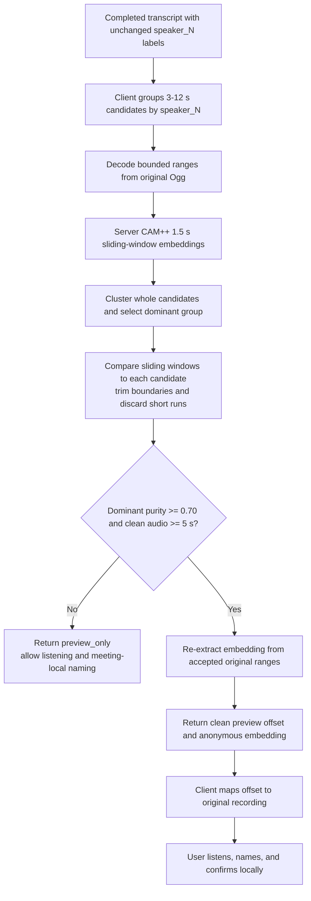

# ADR 0004: Enroll Voiceprints Only From Clean Speaker Ranges

- Status: Accepted
- Date: 2026-08-03
- Last updated: 2026-08-03
- Decision owners: Nota desktop and Nota ASR Server maintainers

## Context

A stable transcript segment can contain rapid turns from several people while
still carrying one meeting-local `speaker_N` label. Treating that entire range
as one enrollment sample can permanently contaminate the local voiceprint and
make future identity suggestions less reliable. Changing the completed meeting
transcript is outside this workflow.

## Decision

Nota keeps normal transcription unchanged. When the user explicitly requests
speaker identification, Rust selects several bounded candidate ranges for each
anonymous speaker and sends them together to the server's versioned CAM++ clean
sample analyzer. Only accepted dominant-speaker ranges may supply a persisted
embedding. Preview is a separate best-effort aid: when enrollment gates fail,
the server still returns a bounded candidate for listening. The speaker remains
nameable for the current meeting, but no voiceprint is stored.

## Alternatives Considered

- Changing transcription segmentation was rejected because speaker identity is
  an optional post-processing feature and must not rewrite a completed result.
- Trusting the longest transcript segment was rejected because duration does
  not prove that only one person speaks inside it.
- Sending names or the local participant library to the server was rejected to
  preserve the local biometric-data ownership boundary.
- Enrolling an uncertain best effort was rejected because a missing sample is
  recoverable; a polluted long-lived voiceprint silently harms later meetings.

## Consequences

- Very short interjections and overlapping speech are intentionally ignored.
- A speaker may be assigned a meeting-local name without producing a reusable
  voiceprint.
- Failure to satisfy biometric enrollment gates does not remove the user's
  ability to listen and identify the speaker manually.
- Identification performs an extra bounded CAM++ pass but normal transcription
  cost and output are unchanged.
- The client must reject servers that do not advertise clean-analysis protocol
  version 1 for this optional feature.

## Compatibility and Evolution

The legacy single-sample embedding endpoint may remain available server-side,
but Nota uses the clean-analysis endpoint for new enrollment. Threshold or
range-policy changes require capability or schema evolution when they alter
client-visible semantics.
