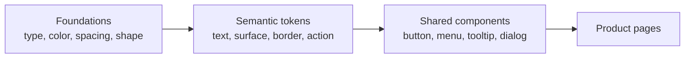

# Nota Visual Design System

- Status: Accepted
- Last updated: 2026-08-11
- Owners: Nota maintainers

This specification is the source of truth for Nota's in-product visual
language. It covers the Windows desktop client, including auxiliary windows.
It is intentionally separate from marketing artwork and release assets.

## Product Character

Nota should feel calm, trustworthy, local, and precise. The visual language
uses warm neutral surfaces and a restrained jade accent so recording state and
meeting content remain more prominent than decoration. Interfaces should feel
native to Windows 11 without impersonating a Microsoft product.

The foundation follows the Windows typography and four-pixel spacing ideas in
[Fluent 2](https://fluent2.microsoft.design/), while Nota owns its palette,
component styling, and product identity. Accessible interaction primitives may
come from [Radix](https://www.radix-ui.com/primitives); adopting a primitive
does not authorize importing that library's default visual identity.

## Sources of Truth

1. `src/design-tokens.css` contains executable global and semantic tokens.
2. This document defines when each token and component treatment is used.
3. Shared React components and CSS component classes encode recurring UI
   patterns.
4. Individual pages must not invent a parallel color or type system.

The token dependency direction is:

## Typography

Use `Segoe UI Variable` on supported Windows versions, then `Segoe UI` and
`Microsoft YaHei UI` as fallbacks. Chinese and Latin content must use the same
semantic type roles. Read-only code and structured request previews use the
shared `--font-family-mono` stack; ordinary controls and content must not use
the monospace role.

Read-only JSON trees use the shared `JsonTreeView` component and the
`--color-syntax-*` semantic roles for keys, strings, numbers, booleans, nulls,
and punctuation. Long values must wrap, nested values must remain keyboard
expandable, and product pages must not import a third-party JSON theme.

| Role | Size / line height | Weight | Usage |
|---|---|---|---|
| Caption | 12 / 16 px | 400 or 600 | Tooltips, timestamps, badges, secondary metadata, dense toolbar actions |
| Body | 14 / 20 px | 400 | Menus, controls, forms, ordinary copy |
| Body strong | 14 / 20 px | 600 | Button labels, list titles, emphasized body text |
| Body large | 18 / 24 px | 400 or 600 | Prominent values and compact window headings |
| Subtitle | 20 / 28 px | 600 | Section and panel headings |
| Title | 28 / 36 px | 600 | Page headings |
| Large title | 40 / 52 px | 600 | Exceptional hero content only |

Rules:

- Product UI text must not be smaller than Caption. Do not introduce 8–11 px
  text to fit a layout; revise the layout instead.
- Tooltips use Caption. Context menus and form controls use Body.
- Use regular, medium, semibold, or bold token weights. Avoid intermediate
  values such as 550 or 650.
- Sentence case is preferred. Weight and semantic color establish hierarchy;
  all-caps text and letter spacing must not be used as substitutes.

## Color

Components consume semantic tokens, not literal colors. The principal roles
are:

| Role family | Intended use |
|---|---|
| `--color-text-*` | Text and foreground hierarchy |
| `--color-surface-*` | Canvas, panels, raised surfaces, hover and status fills |
| `--color-border-*` | Structural, subtle, strong, and status borders |
| `--color-control-*` | Primary, secondary, and destructive actions |
| `--color-icon-*` | Neutral and brand icon hierarchy |

The jade brand color is reserved for primary actions, selected state,
keyboard focus, and positive active state. Warning, danger, success, and info
must use their semantic roles and must not be communicated by color alone.

Normal text must reach a contrast ratio of at least 4.5:1. Large text must
reach at least 3:1. Focus indicators and meaningful non-text controls must be
visually distinguishable in every state.

## Spacing and Layout

Use the four-pixel token rhythm in `src/design-tokens.css`. Half steps of 2,
6, and 10 px are allowed only for compact alignment and icon optical balance.

- 4–8 px: tightly related content inside a control.
- 12–16 px: normal component padding and related groups.
- 20–24 px: sections and panel boundaries.
- 28–32 px: page-level separation.
- 40 px and above: exceptional layout separation.

Fixed dimensions may be used for media, window constraints, grid tracks, or
control geometry, but surrounding spacing must use tokens.

## Shape, Elevation, and Motion

- Small radius (6 px): menu items, tags, compact controls.
- Medium radius (8 px): standard buttons and inputs.
- Large radius (12 px): cards, dialogs, and panels.
- Extra-large radius (16 px): major containers only.
- Fully rounded geometry is limited to avatars, status dots, pills, and round
  playback controls.
- Use the four elevation tokens. Do not encode arbitrary shadow colors in
  component CSS.
- Motion should explain state change. Use the fast or normal duration token,
  and honor `prefers-reduced-motion`.

## Controls and Iconography

Lucide remains Nota's product icon set. Use 14 px icons in compact controls,
16 px by default, and 20 px for navigation or prominent status. Icon-only
buttons need an accessible name and an `AppTooltip`; visible text buttons do
not need a duplicate tooltip.

| Control | Standard |
|---|---|
| Compact icon button | 28 px minimum visual target, 14 px icon |
| Compact text button | 34 px high, Caption strong label, 14 px icon |
| Default icon button | 32 px minimum visual target, 16 px icon |
| Default button/input | 32–36 px high, Body or Body strong label |
| Tooltip | Caption, shown on hover and keyboard focus |
| Context menu item | Body, 32 px minimum height |

Disabled controls must remain identifiable, expose an explanation when the
reason is not obvious, and must not rely on reduced opacity as their only
state distinction.

Compact text buttons are reserved for dense toolbars and inline status banners.
Use the shared `button compact` variant instead of recreating its dimensions in
page-specific CSS.

## Component and Page Rules

- Reuse an existing shared component or class before adding page-specific
  variants.
- New component variants must be named by purpose (`danger`, `secondary`,
  `compact`), not by a literal appearance (`red`, `12px`, `dark-gray`).
- Page CSS may control composition and layout, but shared component anatomy,
  type, color, state, radius, and elevation belong to shared styles.
- Portalled UI such as tooltips, menus, dialogs, and popovers must use tokens
  and must appear above scroll containers without being clipped.
- Keyboard focus must be visible. Hover-only behavior is not sufficient.

## Change and Review Checklist

For every visual change:

1. Identify the semantic role before selecting a token.
2. Reuse or extend a shared component pattern.
3. Verify normal, hover, focus, disabled, loading, empty, error, and long-text
   states that apply.
4. Verify Chinese copy, 125% Windows display scaling, and keyboard navigation.
5. Run `npm run check:design` and the checks appropriate to the changed area.
6. Update this document and the token file together when the visual language
   gains a new durable role.
