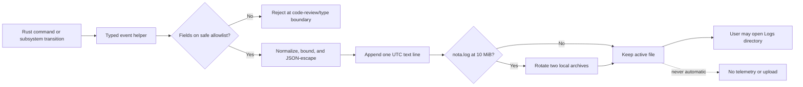

# Local Diagnostic Logging

- Status: Accepted
- Last updated: 2026-08-22
- Owners: Nota desktop maintainers
- Related code: `src-tauri/src/logging.rs`, `src-tauri/src/controller.rs`,
  `src-tauri/src/audio/`, `src-tauri/src/asr.rs`, `src-tauri/src/ai.rs`,
  `src-tauri/src/importer.rs`
- Related decision:
  [`0008-local-privacy-safe-diagnostic-logs.md`](decisions/0008-local-privacy-safe-diagnostic-logs.md)

## Purpose and Scope

Nota writes a small local event log so maintainers can reconstruct meaningful
user actions and backend state transitions without collecting meeting content.
Hotword text is meeting content for this boundary: diagnostics may record a
list id and entry count, but must never record entries, snapshots, or request
bodies.
Logging is always local: Nota does not upload, synchronize, or expose these
files to a remote service. The Settings page may open the log directory but
does not read or render the files.

This specification covers technical diagnostics only. It is not an audit log,
analytics system, transcript history, or substitute for persisted product
state.

## Storage and Rotation

Logs live in the application log directory under `%LOCALAPPDATA%`. The active
file is `nota.log`. At 10 MiB it rotates to `nota.1.log`; the former first
archive becomes `nota.2.log`. Only the active file and two archives are kept,
for an approximate maximum of 30 MiB.

Logs are ordinary UTF-8 text. They are not stored in SQLite, and the unused
legacy `events` table must not be activated for this purpose.

## Record Format

Every record is one line:

```text
<UTC RFC3339 time> <level> component=<JSON string> event=<JSON string> key=<value> ...
```

Text values are JSON-escaped, control characters become spaces, and text
fields are limited to 160 Unicode characters. Numeric and Boolean fields are
unquoted. Components and event names are static application-owned values.

Only typed, allowlisted fields may be emitted. The allowlist is limited to
opaque IDs, enums, Booleans, counts, durations, HTTP status codes, token usage,
process IDs, executable basenames, audio format metadata, and static error
codes. Raw error strings are never passed through the diagnostic interface.

## Event Coverage

The following state transitions are expected:

- recording lifecycle, pause/resume, selected-source and microphone changes,
  finalization, recovery, deletion, clipboard, and export actions;
- audio-device changes, capture reconstruction, continuous capture-health
  failures, recovery, prolonged-silence and audio-resumed transitions, tray
  reminders, and user decisions;
- audio-import batch start, item outcome, cancellation, and completion;
- ASR queueing, protocol selection, coarse phase changes, resume retry,
  cancellation, completion, failure, and elapsed time;
- LLM queueing, dispatch, Provider kind, model ID, estimated input tokens,
  HTTP status, actual usage, cancellation, file commit, failure, and elapsed
  time;
- settings and Provider mutations plus requests to open the log directory.

Read-only queries, UI navigation, hover state, form input, per-frame audio,
per-packet audio, and ordinary polling must not be logged. Transition-only
logging keeps the files useful for `rg` and avoids turning one incident into
thousands of repetitive records.

Opaque correlation fields connect a sequence without exposing content:

- `session_id` for one active recording;
- `recording_id` for durable recordings;
- `generation` for ASR attempts;
- `version_id` and `document_id` for AI generations;
- `batch_id` for audio imports.

## Privacy Boundary

The following data must never enter technical logs:

- audio samples or encoded audio;
- transcript text, segments, speaker names, meeting titles, document bodies,
  window titles, or user-entered context;
- API keys, authorization headers, cookies, or other credentials;
- Base URLs, user file paths, request bodies, response bodies, or Provider
  error bodies.
- temporary `oss://` object names, signed upload fields, task result URLs, or
  complete DashScope control responses.

Executable identity is reduced to a basename before logging. Network failures
use application-owned error codes plus optional HTTP status and duration.
Provider-returned messages remain available only through the existing user
error path or explicitly persisted generation details; they are not diagnostic
fields.



## Evolution

Adding an in-app viewer, exportable diagnostic bundle, verbose switch, or
automatic upload is outside this design. Any future export must introduce a
new user-confirmed workflow, re-evaluate redaction against real files, define
retention explicitly, and receive its own architecture review.
