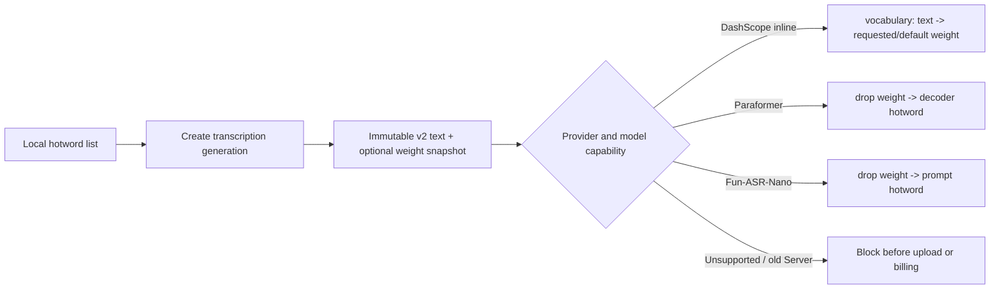

# Local Hotword Library

- Status: Accepted
- Last updated: 2026-08-26
- Owners: Nota desktop and Nota ASR Server maintainers
- Related decision: [ADR 0012](decisions/0012-local-cross-provider-hotword-library.md)

## Purpose and Ownership

Nota stores reusable hotword lists only in the Client SQLite database. A user
may select zero or one list for a transcription. When a generation is created,
Nota copies the list name and normalized entries into that generation; later
editing or deleting the source list never changes historical work.

The library accepts one hotword or short phrase per line and an optional final
weight suffix such as `Busabase:50`. ASCII and full-width colons are accepted;
literal colons in a term are escaped as `\:`. Missing, empty, or zero weights
mean “Provider default.” Values `1` through `5` and super-hotword value `50`
are stored; any other value is visibly normalized to `4` at save time.

Saving trims each line, ignores blank lines, preserves the first exact
duplicate and input order, and enforces 2,000 entries, 100 characters per
entry, 50 super hotwords, and 256 KiB of raw input. Duplicate text with
different weights is rejected with both line numbers. Names are
case-insensitively unique, required, trimmed, and limited to 80 characters.
Empty lists may be saved but cannot be selected for transcription.

## Request Flow

Manual transcription always starts with “Do not use hotwords.” Automatic
transcription remembers a separate list id in settings. If that list is empty,
missing, invalid, or incompatible at recording finalization, the recording is
kept but no generation or remote task is created.

## Provider Rules

| Provider/model | Mode | Limit | Behavior |
|---|---|---:|---|
| DashScope file transcription | `inline` | 2,000 | Sends request-local `vocabulary`; missing weight becomes `4`, supports `1–5` and at most 50 entries at `50` |
| Paraformer SeACo | `decoder_bias` | 500 | Drops weights and maps text to Nota batch `hotwords`, then FunASR `hotword` |
| Fun-ASR-Nano | `prompt` | 500 | Drops weights and maps text to the model prompt list |
| SenseVoice | unsupported | 0 | Blocks before upload |
| OpenAI-compatible | unsupported | 0 | Blocks before request |

DashScope additionally limits a term containing non-ASCII characters to 15
characters and a pure-ASCII phrase to seven whitespace-separated parts. All
provider checks happen before temporary upload or job creation. A resumed task
uses only its generation snapshot.

## Storage and Privacy

- `hotword_lists` owns list identity and timestamps.
- `hotword_entries` owns ordered text plus nullable validated weight and
  cascades with its list. Old rows migrate with `weight = NULL`.
- `settings.auto_transcribe_hotword_list_id` is nullable and cleared when its
  list is deleted.
- `transcriptions.hotword_list_id`, `hotword_list_name`, and
  `hotword_snapshot_json` intentionally have no source-list foreign key.
- New generation snapshots use `{ "version": 2, "entries": [...] }`; the
  reader accepts legacy `string[]` snapshots as entries with null weight.
- Transcript summaries expose only list name and count; the complete snapshot
  stays in Rust and is never returned through transcript IPC.
- Logs may contain list id, count, Provider, model, and stable error code, but
  never hotword text, request bodies, transcript text, audio, or credentials.

## Compatibility

New Client plus old Server works unchanged when no list is selected. When a
list is selected, the Client requires `hotword_request_version: "1"` and a
model-level `hotwords` declaration before upload. New Server request fields are
optional, so old clients continue to submit ordinary jobs.

## Acceptance Checklist

- CRUD normalization, name conflicts, deletion, and settings cleanup are
  covered by SQLite tests.
- Full-width colons, zero/invalid weights, escaped literal colons, weight
  conflicts, the 50-super-hotword limit, and legacy schema migration are
  covered by parser and SQLite tests.
- A generation snapshot survives source-list edits and deletion.
- DashScope, Paraformer, and Nano parameter mappings have unit tests.
- Unsupported models and old Servers fail before upload or remote billing.
- Manual selection resets to none; auto selection persists independently.
- Version history shows only list name and count.
- Diagnostics do not contain hotword bodies.
