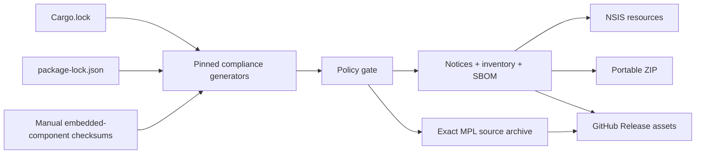

# Open-source compliance

- Status: Accepted
- Last updated: 2026-08-13
- Owners: Nota release maintainers

Nota is MIT licensed. Every bundled dependency retains its own license. Release
artifacts must carry the legal notices and source-availability information
required by the exact locked Windows x64 dependency graph.

## Policy and generation

Run:

```powershell
cargo install cargo-about --locked --version 0.9.1 --features cli
npm ci
npm run licenses:generate
npm run licenses:check
```

The generator uses pinned `cargo-about 0.9.1` for Rust and
`license-checker-rseidelsohn 5.0.1` for production npm packages. It produces:

- `THIRD_PARTY_LICENSES.md`: package/version/license inventory;
- `THIRD_PARTY_NOTICES.txt`: complete redistributable license texts;
- `THIRD_PARTY_SOURCES.md`: reciprocal-license and embedded-native source map;
- `bom.cyclonedx.json`: CycloneDX 1.6 application SBOM.

`src-tauri/about.toml` is the Rust allowlist. The npm generator independently
rejects unknown or prohibited expressions. AGPL, SSPL, BUSL, GPL, LGPL, and
unknown licenses require review; they must never be accepted by broad pattern.
An exception must identify one package/version, rationale, source, and license
file checksum.

The repository-level `.npmrc` pins dependency downloads to
`https://registry.npmjs.org/`. A contributor's user-level mirror must not leak
into `package-lock.json`; review lock-file diffs for non-official `resolved`
hosts before merging or releasing.

The vendored libopus snapshot inside `audiopus_sys` is tracked manually because
Cargo metadata describes only the wrapper crate. Its upstream commit and BSD
license checksum are pinned in `scripts/licenses/manual-components.json`.

## Release contract



The NSIS bundle uses `bundle.licenseFile` and installs the project license plus
third-party notices, source map, and SBOM as resources. The portable ZIP carries
the same files. The release workflow also publishes
`Nota-<version>-mpl-sources.zip`, containing unmodified source directories for
the locked MPL-2.0 Rust crates, plus standalone notices and checksums.

Packaging must fail if any required legal file is absent or stale. Published
release assets are immutable; a compliance correction requires a new patch
release.

## Review rules

- Evaluate runtime and build-time inclusion separately; development-only npm
  packages are not part of the desktop binary notice set.
- Preserve MPL-2.0 dependencies when technically appropriate; provide their
  exact source rather than replacing them solely to avoid reciprocal terms.
- Do not copy all registry sources into Git. Generate the versioned source
  archive from the lock file at release time.
- Regenerate after every dependency or lock-file change and review the diff.
- Generated package and SBOM ordering must use locale-independent comparison
  so Windows developer machines and GitHub runners produce identical bytes.
- An SBOM is an inventory, not a substitute for license texts or source offers.
