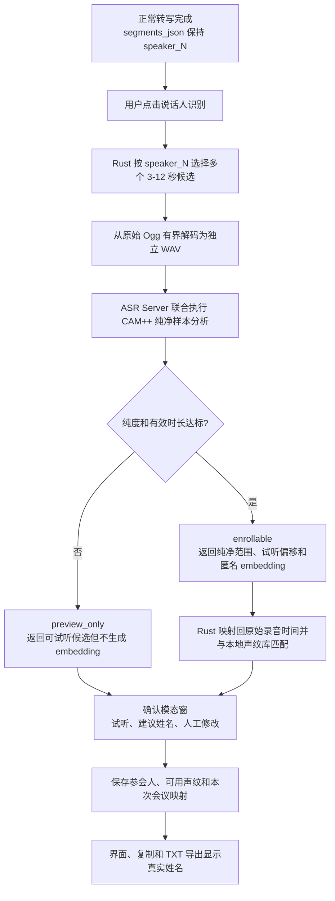
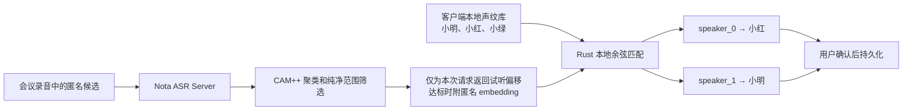

# Speaker Identification and Local Voiceprints

- Status: Accepted
- Last updated: 2026-08-03
- Owners: Nota maintainers

This specification describes the optional, user-triggered workflow that maps
anonymous meeting-local labels such as `speaker_0` to locally managed names.
It is deliberately separate from normal transcription and diarization.

## System Flow

The trust and ownership boundary is:

## Invariants

- Normal transcription remains unchanged and must continue to store raw
  `speaker_N` labels in `segments_json`.
- Identification runs only after an explicit user action. It is not part of
  recording, upload, transcription, or automatic-transcription completion.
- The ASR Server extracts anonymous CAM++ embeddings but never receives
  participant names and never maintains a people registry.
- Participant names, embeddings, similarity matching, and confirmed meeting
  assignments belong to the Rust backend and local SQLite database. Raw
  embeddings must not be sent to the React frontend.
- A suggestion is not an identity assertion. The user must confirm mappings
  before Nota changes any displayed name or saves a new voiceprint.
- Saved assignments are scoped by recording and transcription generation.
  Retranscription must not silently reuse assignments from an older generation.
- The resolved display label is `participant name ?? raw speaker label`.
  Detail views, copy, and TXT export must use the same resolver.
- Failure to find a clean sample must not modify or fail the completed
  transcript. It only prevents reusable voiceprint enrollment for that speaker.

## Candidate Planning and Bounded Decode

For each anonymous speaker, Rust sorts transcript ranges by duration and selects
up to the server-advertised candidate count. A candidate must be at least three
seconds, is capped at six seconds, and the combined request targets up to 30
seconds within the advertised total duration and byte limit. The first pass
prefers candidates whose midpoints are at least ten seconds apart; a second pass
fills unused capacity. Sub-three-second interjections are deliberately ignored
for voiceprint enrollment.

Rust streams the original Ogg once and copies only the selected ranges into
separate 16 kHz mono PCM16 WAV files. It must not decode an entire meeting into
memory. Separate files preserve source boundaries so the server can return a
`file_index` plus relative timestamps that Rust can map back to the original
recording.

## CAM++ Clean-Sample Filtering

All candidates in one request belong to one raw `speaker_N` label. The server
first clusters whole-candidate CAM++ embeddings and selects the dominant
candidate cluster. It then applies 1.5-second CAM++ windows with a 0.75-second
shift inside those candidates, compares each window with its own candidate,
smooths sub-0.7-second turns, trims uncertain speaker-change boundaries, and
discards clean runs shorter than three seconds.

The dominant candidate set is enrollable only when its stable-window purity is
at least 0.70 and at least five seconds of clean audio remains. The final
embedding is then recomputed from the accepted original-audio ranges. This
prevents a sliding analysis window that crossed a detected boundary from
entering the long-lived voiceprint. If the gates fail, the server returns a
successful `preview_only` result with no embedding. The client keeps preview
and meeting-local naming available but cannot enroll a reusable voiceprint.

These rules favor missing enrollment over polluted biometric data. They do not
claim to solve simultaneous overlapping speech, and they intentionally ignore
the extremely short one-character interjection described in the motivating
meeting example.

## Preview

For an enrollable sample, the server selects the longest stable range and
returns at most eight seconds as the preview. For `preview_only`, it returns the
best stable range it found or a bounded fallback from the dominant candidate.
If analysis cannot run at all, Rust retains a bounded original transcript
range as a final fallback. Rust validates the selected file index and bounds,
converts the relative range to absolute meeting timestamps, and exposes only
those timestamps to React.

Preview reuses the original recording and existing seek playback. Nota does not
create or retain a duplicate preview audio file. The Voiceprints workspace uses
the same stored clean preview offsets. Deleting a source recording therefore
makes that sample unavailable for preview without invalidating its embedding.

## Matching and Confirmation

Rust L2-normalizes compatible embeddings and compares them with cosine
similarity. A participant prototype is the normalized average of that
participant's compatible samples. Automatic preselection requires both a
minimum similarity and a sufficient margin over the runner-up; otherwise the
candidate remains unresolved.

The initial conservative gates are cosine similarity `>= 0.78` and runner-up
margin `>= 0.05`. They control preselection only, never automatic persistence,
and must be recalibrated with representative device and meeting audio before
being described as an accuracy guarantee.

The confirmation dialog shows the anonymous speaker, sample status, preview
action, suggested participant and score, plus a name field. It distinguishes a
reusable `enrollable` sample from `preview_only` and `unavailable`; only the
last state disables preview.
The user may select an existing participant, create a new one, map multiple
anonymous clusters to the same participant, or leave a speaker unresolved. A
name assignment without a clean embedding applies to this meeting but creates
no reusable voiceprint sample.

Saving is transactional: participants are created or updated, available
embeddings are stored for named candidates, and current-generation assignments
are replaced as one operation. Dismissing the dialog saves nothing.

## Local Lifecycle

- Renaming a participant changes historical resolved display names because
  assignments reference the participant id.
- Deleting one voiceprint sample preserves the participant and historical
  assignments.
- Deleting a participant removes its samples and assignments; affected
  meetings fall back to their raw `speaker_N` labels after confirmation.
- Deleting a recording removes its meeting assignments. Voiceprint samples may
  remain, but their source recording and preview reference become null.
- Embeddings with a different model fingerprint or vector dimension are not
  compared.

See ADR 0003 for local ownership and separation, and ADR 0004 for the clean
sample policy. The server endpoint schema remains canonical in the Nota ASR
Server repository.
