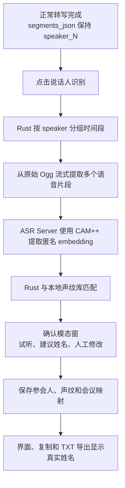
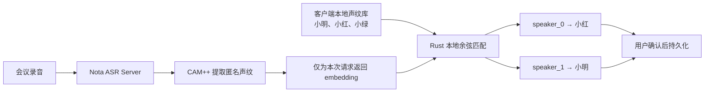

# Speaker Identification and Local Voiceprints

- Status: Accepted
- Last updated: 2026-08-02
- Owners: Nota maintainers

This specification describes the optional, user-triggered workflow that maps
anonymous meeting-local labels such as `speaker_0` to locally managed names.
It is deliberately separate from normal transcription and diarization.

## System Flow

The trust and ownership boundary is:

## Invariants

- Normal transcription remains unchanged and must continue to store raw
  `speaker_N` labels in `segments_json`.
- Identification runs only after an explicit user action. It is not part of
  recording, upload, transcription, or automatic-transcription completion.
- The ASR Server extracts CAM++ embeddings but never receives participant
  names and never maintains a people registry.
- Participant names, embeddings, similarity matching, and confirmed meeting
  assignments belong to the Rust backend and local SQLite database. Raw
  embeddings must not be sent to the React frontend.
- A suggestion is not an identity assertion. The user must confirm mappings
  before Nota changes any displayed name or saves a new voiceprint.
- Saved assignments are scoped by recording and transcription generation.
  Retranscription must not silently reuse assignments from an older
  generation.
- The resolved display label is `participant name ?? raw speaker label`.
  Detail views, copy, and TXT export must use the same resolver.

## Extraction and Preview

For each anonymous speaker, Rust selects multiple sufficiently long,
non-overlapping transcript ranges and streams the original Ogg once. It writes
only bounded 16 kHz mono PCM WAV samples needed by the extraction request; it
must not decode a whole meeting into memory. One representative range is also
returned as the preview timestamp.

Preview reuses the original recording and existing seek playback. Nota does
not create or retain a duplicate preview audio file. Deleting a source
recording therefore makes that sample unavailable for preview without
invalidating its stored embedding.

## Matching and Confirmation

Rust L2-normalizes compatible embeddings and compares them with cosine
similarity. A participant prototype is the normalized average of that
participant's compatible samples. Automatic preselection requires both a
minimum similarity and a sufficient margin over the runner-up; otherwise the
candidate remains unresolved.

The initial conservative gates are cosine similarity `>= 0.78` and runner-up
margin `>= 0.05`. They control preselection only, never automatic persistence,
and must be recalibrated with representative device and meeting audio before
being described as an accuracy guarantee.

The confirmation dialog shows the anonymous speaker, accumulated speaking
duration, preview action, suggested participant and score, plus a name field.
The user may select an existing participant, create a new one, map multiple
anonymous clusters to the same participant, or leave a speaker unresolved.

Saving is transactional: participants are created or updated, embeddings are
stored for named candidates, and current-generation assignments are replaced
as one operation. Dismissing the dialog saves nothing.

## Local Lifecycle

- Renaming a participant changes historical resolved display names because
  assignments reference the participant id.
- Deleting one voiceprint sample preserves the participant and historical
  assignments.
- Deleting a participant removes its samples and assignments; affected
  meetings fall back to their raw `speaker_N` labels after confirmation.
- Deleting a recording removes its meeting assignments. Voiceprint samples
  may remain, but their source recording and preview reference become null.
- Embeddings with a different model fingerprint or vector dimension are not
  compared.

See ADR 0003 for the ownership and separation rationale. The server endpoint
schema remains canonical in the Nota ASR Server repository.
