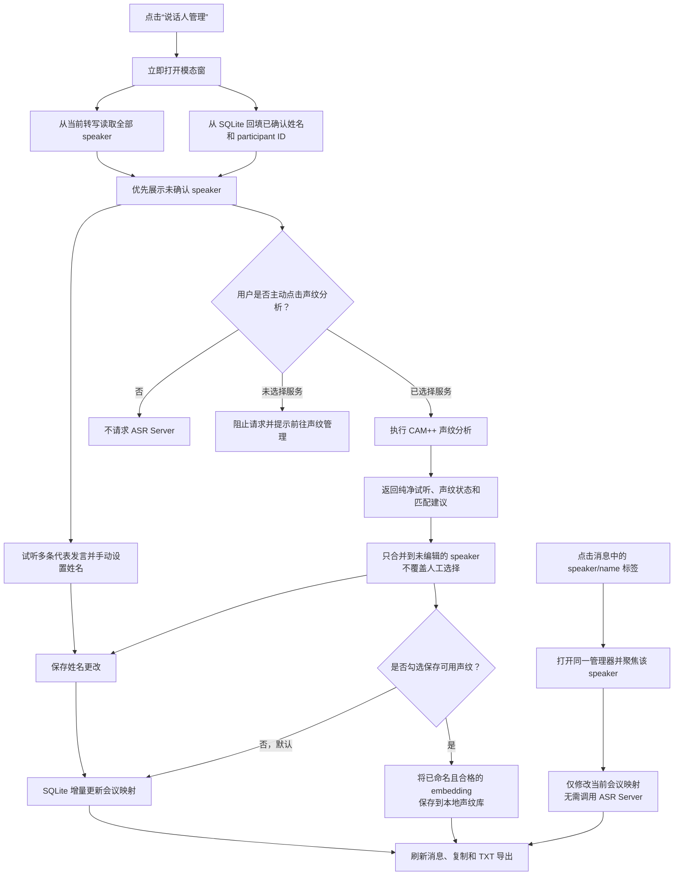
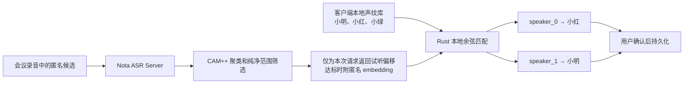

# Speaker Identification and Local Voiceprints

- Status: Accepted
- Last updated: 2026-08-22
- Owners: Nota maintainers

This specification describes the optional, user-triggered workflow that maps
anonymous meeting-local labels such as `speaker_0` to locally managed names.
It is deliberately separate from normal transcription and diarization.

## System Flow

The trust and ownership boundary is:

## Invariants

- Normal transcription remains unchanged and must continue to store raw
  `speaker_N` labels in `segments_json`.
- Opening speaker management must not start embedding extraction. CAM++
  analysis runs only after the user explicitly presses the analysis action and
  a voiceprint extraction provider is selected. It is not part of recording,
  upload, transcription, or automatic-transcription completion.
- The ASR Server extracts anonymous CAM++ embeddings but never receives
  participant names and never maintains a people registry.
- Participant names, embeddings, similarity matching, and confirmed meeting
  assignments belong to the Rust backend and local SQLite database. Raw
  embeddings must not be sent to the React frontend.
- A suggestion is not an identity assertion. The user must confirm mappings
  before Nota changes any displayed name or saves a new voiceprint.
- An already confirmed assignment outranks a new automatic suggestion, and an
  in-progress user edit outranks both. Late analysis results must never reset
  either state.
- Saved assignments are scoped by recording and transcription generation.
  Retranscription must not silently reuse assignments from an older generation.
- Switching the completed transcript version loads that generation's speaker
  assignments and Provider capabilities together. An in-progress voiceprint
  session becomes stale if the current generation changes before save.
- The resolved display label is `participant name ?? raw speaker label`.
  Detail views, copy, and TXT export must use the same resolver.
- Failure to find a clean sample must not modify or fail the completed
  transcript. It only prevents reusable voiceprint enrollment for that speaker.
- Meeting-local assignment editing must remain available without an ASR Server.
  It updates names only and must not create or mutate a voiceprint sample.
- Voiceprint availability is a transcription-generation property. A DashScope
  generation retains anonymous speaker playback and manual names but never
  permits CAM++ analysis or enrollment, even after the default transcription
  Provider changes. Rust rejects a direct or stale-UI attempt with
  `voiceprint_not_supported_for_transcription_provider` before network access.

## Continuous Management

The manager opens from either the recording-detail action or any speaker label.
Both entry points remain local and make no network request. A label opens the
same manager on that raw speaker. In both cases the speaker list and current
assignments come from the local transcript immediately.

CAM++ analysis is a separate opt-in action inside the manager. The action is
unavailable until the user selects a compatible FunASR provider under
**Voiceprints > Voiceprint extraction service**. Provider presence is checked
from local settings; network connectivity and server capabilities are checked
only after the explicit analysis click. The manager keeps all manual naming and
representative-preview controls available when no provider exists or analysis
fails.

For a generation whose transcription Provider does not support Nota
voiceprints, the manager instead shows the Provider name and the permanent
generation-level limitation. It does not offer **Go to voiceprint management**,
and both analysis and enrollment controls remain unavailable. Manual meeting
names and representative playback remain fully functional.

Each speaker exposes up to five representative transcript utterances chosen by
duration and then displayed chronologically. These bounded original-recording
ranges remain available even when CAM++ returns `preview_only` or analysis
fails. The CAM++-selected clean range is an additional preview, not the only
way to identify the person.

Closing the manager while analysis is pending invalidates that UI request. If
the opaque Rust session arrives later, React must discard it. A result may
populate a suggestion only for an untouched, unresolved speaker. It cannot
overwrite a persisted assignment or a selection already edited in the dialog.

The manager orders unresolved speakers before confirmed speakers and keeps
confirmed participant ids selected on every reopen. Saving names before
analysis finishes persists current meeting assignments only. After successful
analysis, reusable voiceprint enrollment remains disabled by default and
requires a separate user-controlled checkbox.

Every clean preview and representative utterance has a stable UI playback id.
Only the active range displays its playing color and pause icon. Pausing,
reaching the range end, switching speaker, closing the manager, or starting a
different preview must update or clear that state so the visual control never
claims that an unrelated range is playing.

## Candidate Planning and Bounded Decode

For each anonymous speaker, Rust sorts transcript ranges by duration and selects
up to the server-advertised candidate count. A candidate must be at least three
seconds, is capped at six seconds, and the combined request targets up to 30
seconds within the advertised total duration and byte limit. The first pass
prefers candidates whose midpoints are at least ten seconds apart; a second pass
fills unused capacity. Sub-three-second interjections are deliberately ignored
for voiceprint enrollment.

Rust streams the original Ogg once and copies only the selected ranges into
separate 16 kHz mono PCM16 WAV files. It must not decode an entire meeting into
memory. Separate files preserve source boundaries so the server can return a
`file_index` plus relative timestamps that Rust can map back to the original
recording.

## CAM++ Clean-Sample Filtering

All candidates in one request belong to one raw `speaker_N` label. The server
first clusters whole-candidate CAM++ embeddings and selects the dominant
candidate cluster. It then applies 1.5-second CAM++ windows with a 0.75-second
shift inside those candidates, compares each window with its own candidate,
smooths sub-0.7-second turns, trims uncertain speaker-change boundaries, and
discards clean runs shorter than three seconds.

The dominant candidate set is enrollable only when its stable-window purity is
at least 0.70 and at least five seconds of clean audio remains. The final
embedding is then recomputed from the accepted original-audio ranges. This
prevents a sliding analysis window that crossed a detected boundary from
entering the long-lived voiceprint. If the gates fail, the server returns a
successful `preview_only` result with no embedding. The client keeps preview
and meeting-local naming available but cannot enroll a reusable voiceprint.

These rules favor missing enrollment over polluted biometric data. They do not
claim to solve simultaneous overlapping speech, and they intentionally ignore
the extremely short one-character interjection described in the motivating
meeting example.

## Preview

For an enrollable sample, the server selects the longest stable range and
returns at most eight seconds as the preview. For `preview_only`, it returns the
best stable range it found or a bounded fallback from the dominant candidate.
If analysis cannot run at all, Rust retains a bounded original transcript
range as a final fallback. Rust validates the selected file index and bounds,
converts the relative range to absolute meeting timestamps, and exposes only
those timestamps to React.

Preview reuses the original recording and existing seek playback. Nota does not
create or retain a duplicate preview audio file. The Voiceprints workspace uses
the same stored clean preview offsets. Deleting a source recording therefore
makes that sample unavailable for preview without invalidating its embedding.

## Matching and Confirmation

Rust L2-normalizes compatible embeddings and compares them with cosine
similarity. A participant prototype is the normalized average of that
participant's compatible samples. Automatic preselection requires both a
minimum similarity and a sufficient margin over the runner-up; otherwise the
candidate remains unresolved.

The initial conservative gates are cosine similarity `>= 0.78` and runner-up
margin `>= 0.05`. They control preselection only, never automatic persistence,
and must be recalibrated with representative device and meeting audio before
being described as an accuracy guarantee.

The management dialog shows the anonymous speaker, persisted assignment,
sample status, clean preview action, representative transcript utterances,
suggested participant and score, plus a name field. It distinguishes a reusable
`enrollable` sample from `preview_only` and `unavailable`; transcript utterance
preview remains independent of all three states.
The user may select an existing participant, create a new one, map multiple
anonymous clusters to the same participant, or leave a speaker unresolved. A
name assignment without a clean embedding applies to this meeting but creates
no reusable voiceprint sample.

Name saving is transactional and incremental. Participants are created or
reused, changed current-generation assignments are upserted, an explicit clear
deletes only its raw speaker mapping, and omitted speakers remain unchanged.
This path never creates or mutates a voiceprint.

Voiceprint enrollment is optional even after successful analysis. The checkbox
is disabled unless at least one candidate has both a confirmed identity and an
enrollable embedding. When selected, the confirmation transaction applies the
explicit mapping patches and upserts only the named, eligible embeddings. The
source recording, transcription generation, and raw speaker uniqueness key
prevents duplicate samples from accumulating for repeated saves. Dismissing the
dialog saves nothing.

## Local Lifecycle

- Renaming a participant changes historical resolved display names because
  assignments reference the participant id.
- Deleting one voiceprint sample preserves the participant and historical
  assignments.
- Deleting a participant removes its samples and assignments; affected
  meetings fall back to their raw `speaker_N` labels after confirmation.
- Deleting a recording removes its meeting assignments. Voiceprint samples may
  remain, but their source recording and preview reference become null.
- Embeddings with a different model fingerprint or vector dimension are not
  compared.

See ADR 0003 for local ownership and separation, and ADR 0004 for the clean
sample policy. The server endpoint schema remains canonical in the Nota ASR
Server repository.
